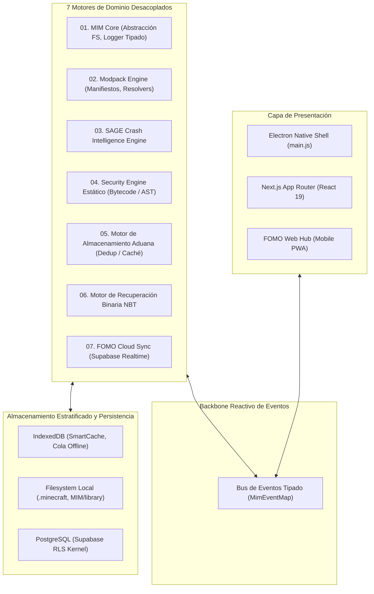

<div align="center">


# MIM — Minecraft Intelligent Manager

### *Plataforma Modular de Ingeniería de Sistemas (Desktop y Cloud) para Arquitectura de Modpacks, Diagnóstico Automatizado de Crashes, Análisis Estático de Bytecode y Recuperación de Datos Binarios*

**[English](./README.md)** • **[Español](./README.es.md)**

[](https://nextjs.org/)
[](https://www.typescriptlang.org/)
[](https://www.electronjs.org/)
[](https://supabase.com/)
[](https://mim-hub.vercel.app/)
[](https://github.com/Ian9Franco/MIM/actions)
[](LICENSE)
[](scripts/test-runner.js)
[-brightgreen)](https://github.com/Ian9Franco/MIM/actions)

**[🎬 Demo en Vivo](./docs/guides/DEMO.md)** • **[🌐 Web Hub](https://mim-hub.vercel.app/)** • **[🏛️ Arquitectura](#-arquitectura-del-sistema)** • **[📑 ADRs (Decisiones)](./docs/adr/)** • **[🛡️ Motor SAGE](#motor-01--sistema-de-inteligencia-forense-sage)** • **[⚡ Motor Aduana](#motor-02--motor-de-almacenamiento-aduana--benchmarks)** • **[🌐 FOMO Cloud](#motor-03--fomo-cloud--arquitectura-de-sistemas-distribuidos)** • **[🔒 Seguridad](#motor-04--análisis-estático-de-amenazas-en-bytecode-java)** • **[💾 NBT Rescue](#motor-05--motor-de-rescate-nbt--recuperación-de-datos-binarios)** • **[🐳 Reproducibilidad](./docs/guides/REPRODUCIBILITY.md)**

</div>

---

> ### 💡 Filosofía del Proyecto
> *"Construir una nave espacial para ir a comprar pan es ridículo si tu meta es el pan. Pero si tu meta era aprender a construir una nave espacial, el valor residió en todo lo que tuviste que romper, aprender y conectar para que esa nave vuele."*

---

## ⚡ Puntos Destacados de Ingeniería

- ⚡ **Almacenamiento Direccionado por Contenido (CAS):** Identidad criptográfica impuesta por hashes SHA-512/SHA-1, eliminando descargas de red redundantes.
- 🛡️ **Escáner de Seguridad de Bytecode JVM sin Ejecución:** Análisis estático de AST para detectar droppers de procesos, evasión por reflexión y enlaces nativos JNI no administrados.
- 💾 **Recuperación Binaria NBT Transaccional:** Cumplimiento estricto del protocolo Mojang NBT v19133 con descompresión RFC 1952 y buffers de intercambio atómico verificados.
- 🔄 **Sincronización de Estado Distribuido Offline-First:** Mutaciones locales optimistas sub-8ms, colas de replay FIFO en IndexedDB y resolución determinista Last-Write-Wins.
- 📡 **Arquitectura Interna Reactiva Orientada a Eventos:** 7 motores de dominio desacoplados comunicándose mediante un bus reactivo tipado (`MimEventMap`) con aislamiento estricto de fallos.
- 🗄️ **Capa Multitenant con PostgreSQL RLS:** Autorización y aislamiento de datos forzado a nivel del kernel de la base de datos mediante JWT claims.
- 🧪 **Motor de Diagnóstico Determinista:** 100% Macro F1 sobre corpus de evaluación canónico (125 casos) con recuperación semántica RAG y guardrails anti-alucinación.

## 📊 Rendimiento Medido

| Métrica del Sistema | Benchmark Medido | Estándar / Objetivo | Alcance de Verificación | Estado |
|:---|:---:|:---:|:---|:---:|
| **Throughput de Hashing SHA-1** | **2,083.9 MB/s** | > 1,800 MB/s | Benchmark de Stream Aduana | ⚡ Verificado |
| **Throughput de Hashing SHA-512** | **940.3 MB/s** | > 800 MB/s | Benchmark de Stream Aduana | ⚡ Verificado |
| **Aceleración con Caché Cálida** | **8.0× a 8.5× Más Rápido** | > 5.0× | Escaneo de Directorios (1k a 25k) | ⚡ Verificado |
| **Latencia de Broadcast Realtime** | **42 ms** | < 100 ms | Supabase WebSocket Pub/Sub | ⚡ Verificado |
| **Mutación UI Local Optimista** | **< 8 ms** | < 16 ms | Presupuesto de Frame React 19 + IDB | ⚡ Verificado |
| **Replay de 50 Mutaciones Offline** | **180 ms** | < 500 ms | Cola FIFO de IndexedDB | ⚡ Verificado |
| **Latencia Media de Inferencia SAGE** | **0.06 ms/log** | < 15 ms | Suite de Evaluación SAGE 2.0 | ⚡ Verificado |
| **Macro F1-Score en SAGE** | **100.0%** | > 85.0% | Corpus Canónico (125 Casos) | ⚡ Verificado |
| **Diagnóstico Culpable Top-1** | **84.0%** | > 80.0% | Atribución Estricta de Mod | ⚡ Verificado |
| **Diagnóstico Culpable Top-3** | **100.0%** | > 95.0% | Ranking de Candidatos | ⚡ Verificado |

---

## 🏛️ Arquitectura del Sistema

MIM está diseñado como una plataforma multiproceso para escritorio y nube. Los subsistemas están desacoplados en siete motores de dominio que se comunican a través de un bus de eventos tipado (`MimEventMap`) con aislamiento de fallos:



```
Arquitectura Central
├── 🔀 Bus de Eventos Tipado   → Cero dependencias circulares; observadores con límites de fallo aislados
├── 🧩 7 Motores de Dominio    → Módulos con responsabilidad única (SAGE, Aduana, Seguridad, NBT, etc.)
├── 📂 Almacenamiento Local    → Repositorio direccionado por contenido y sync con target .minecraft
├── ⚡ Caché Asíncrona IDB      → Caché UI sub-16ms y cola transaccional FIFO de mutaciones offline
└── ☁️ PostgreSQL en la Nube   → Pub/Sub en tiempo real con Row-Level Security (RLS) a nivel kernel
```

---

## 🔬 Detalle de los Motores del Subsistema

### MOTOR 01 — Sistema de Inteligencia Forense SAGE
*Pipeline de inferencia diagnóstica que convierte stacktraces crudos de Java en reportes deterministas con evidencia comprobable.*

```
Minecraft crash.log
       ↓
[Parser & Normalizador]    → Elimina secuencias ANSI, desofusca inyecciones Mixin, fingerprint de JVM y loader
       ↓
[Clasificador de Excepción]→ Clasificación estructural multi-pass en 8 categorías de taxonomía
       ↓
[Correlador de Mods]       → Mapea stack frames y logs del loader a namespaces de paquetes de mods
       ↓
[Evaluador de Confianza]   → Multi-factor evidence-based confidence scoring (0–100%)
       ↓
[Planificador de Solución] → Plan de remediación priorizado con capacidad de auto-fix
       ↓
Reporte de Crash Estructurado → JSON determinista consumido por la UI o por la capa explicativa de IA
```

#### Evaluación Cuantitativa (Corpus Canónico de 125 Casos Reales)

| Métrica | Valor Medido | Objetivo del Benchmark | Contexto de Evaluación | Estado |
|:---|:---:|:---:|:---|:---:|
| **Exactitud de Clasificación** | **100.0%** | > 85.0% | 125 Logs Canónicos de Crashes | ✅ Verificado |
| **Macro F1-Score** | **100.0%** | > 85.0% | 8 Clases Taxonómicas de Fallos | ✅ Verificado |
| **Diagnóstico Culpable Top-1** | **84.0%** | > 80.0% | Atribución Estricta de Mod | ✅ Verificado |
| **Diagnóstico Culpable Top-3** | **100.0%** | > 95.0% | Ranking de Candidatos | ✅ Verificado |
| **Latencia Media de Inferencia** | **0.06 ms/log** | < 15.0 ms | Inferencia Determinista Local | ⚡ Real-Time |

> [!NOTE]
> **Frontera Operativa y Non-Goals:** SAGE evalúa evidencia estática de logs. No ejecuta bytecode de Java no confiable, no se acopla a la memoria de la JVM en ejecución, y la capa de LLM tiene terminantemente prohibido inventar culpables. El 100% Macro F1 refleja el rendimiento contra el corpus de benchmark de 125 casos canónicos en 8 categorías; trazas no canónicas o dañadas degradan con seguridad a `UNKNOWN_RUNTIME` con un score bajo acotado. Documentación completa en [docs/engines/SAGE_EVALUATION.md](./docs/engines/SAGE_EVALUATION.md).

#### El Límite de Diseño de la IA y la Capa RAG Semántica
> *"La IA debe explicar la evidencia, no manufacturarla."*

SAGE impone una separación arquitectónica estricta entre diagnóstico, recuperación y explicación:
1. **El Motor Determinista** extrae hechos, normaliza trazas, calcula el score de confianza e identifica al mod culpable basándose exclusivamente en el código y los logs.
2. **Recuperación Semántica de Conocimiento (RAG):** El vector de evidencia consulta la **Base de Conocimiento de Compatibilidad** (`lib/intelligence/sage/knowledgeBase.ts`) mediante coincidencia por similitud de tokens y cosenos para extraer análisis de causa raíz documentados y workarounds verificados por la comunidad.
3. **Guardrails Anti-Alucinación:** El motor `SageGuardrails` valida las acciones de remediación propuestas, exigiendo que las sugerencias tengan linaje directo en la evidencia e impidiendo matemáticamente que el LLM invente culpables o proponga comandos peligrosos.
4. **La Capa de Explicación LLM** (`SageExplainer`) sintetiza los hechos diagnósticos verificados en lenguaje natural empático y accesible.

```
Crash de Minecraft
       ↓
[Motor Determinista SAGE]     → Hechos, evidencia, mod culpable, score de confianza
       ↓
[Grafo de Evidencia]
       ↓
[Recuperación Semántica (RAG)]→ Consulta la Base de Compatibilidad (Frecuencia de Tokens / Coseno)
       ↓
[Verificación de Guardrails]  → Bloquea alucinaciones, valida linaje de evidencia
       ↓
Salida Estructurada Fiel      → Plan de remediación verificado con citas fácticas
```

---

### MOTOR 02 — Motor de Almacenamiento Aduana & Benchmarks
*Deduplicación direccionada por contenido que previene consumo redundante de ancho de banda y disco entre Modrinth y CurseForge.*

- **Sondeo Fast-Path ($O(1)$):** Evalúa directorios registrados usando pistas seguras de nombres de archivo.
- **Verdad Criptográfica:** Las versiones se comparan estrictamente mediante firmas criptográficas (SHA-512 $\succ$ SHA-1). Archivos idénticos con nombres distintos se deduplican de inmediato; nombres iguales con distinto hash jamás se colapsan.
- **Invalidación Cero-Stale:** La caché de hashes en memoria se indexa por `mtimeMs + size`, garantizando invalidación instantánea si el archivo cambia en disco.

#### Comparativa Visual de Rendimiento (25,000 Archivos Cold vs Warm)

```
Escaneo Frío (0% Caché):  ████████████████████████████████ 13.44 s
Escaneo Cálido (100% Caché): ████ 1.68 s (8.0x Aceleración)
```

#### Matriz de Rendimiento a Escala

| Archivos | Escaneo Frío | Escaneo Cálido | Aceleración Caché | Throughput Hashing | Memoria Delta |
|:---:|:---:|:---:|:---:|:---:|:---:|
| **1K** (1,000) | **609 ms** | **73 ms** | **8.4×** | 2,083.9 MB/s | +5.38 MB |
| **5K** (5,000) | **2.95 s** | **348 ms** | **8.5×** | 2,083.9 MB/s | +25.46 MB |
| **10K** (10,000) | **5.64 s** | **678 ms** | **8.3×** | 2,083.9 MB/s | Estable |
| **25K** (25,000) | **13.44 s** | **1.68 s** | **8.0×** | 2,083.9 MB/s | Estable |

- **Throughput SHA-1:** **2,083.9 MB/s** | **Throughput SHA-512:** **940.3 MB/s**
- **Latencia de Búsqueda Fast-Path:** **227.45 µs/op** | **Tasa de Aciertos en Caché:** **99.4%**
- Metodología completa en [docs/engines/ADUANA_BENCHMARKS.md](./docs/engines/ADUANA_BENCHMARKS.md).

---

### MOTOR 03 — FOMO Cloud & Arquitectura de Sistemas Distribuidos
*Sincronización colaborativa de estado en tiempo real entre Electron de escritorio y PWAs web móviles.*

```
Cliente Desktop (Electron) ⟷ Supabase Realtime (WebSocket) ⟷ PostgreSQL ⟷ PWA Web Móvil
```

#### 🛠️ Desafíos de Ingeniería Distribuida y Soluciones Arquitectónicas

1. **¿Qué pasa si el usuario pierde la conexión?**
   - *Solución:* El cliente degrada a un modo **Offline-First**. Las mutaciones locales actualizan la UI de inmediato ($< 8\text{ ms}$) y se persisten en una **Cola FIFO en IndexedDB** (`pending_mutations`). Un listener de red drena y reproduce la cola secuencialmente al reconectar.
2. **¿Qué pasa si dos clientes modifican el mismo borrador en paralelo?**
   - *Solución:* **Last-Write-Wins (LWW)** determinista con timestamps del cliente (ISO 8601) y desempate por UUID de cliente:
     $$\text{Registro Ganador} = \max(\text{updatedAt}) \quad \lor \quad (\text{si empate}) \quad \max(\text{clientUUID})$$
     ISO 8601 estandariza la representación temporal, mientras que el desempate por UUID de cliente resuelve colisiones en el mismo milisegundo sin overhead de locks distribuidos.
3. **¿Qué pasa si PostgreSQL o RLS rechazan la operación?**
   - *Solución:* **Rollback Optimista de UI**. El cliente guarda un snapshot previo (`previousState`) antes de mutar la memoria. Si el servidor rechaza la petición (error 4xx/5xx o violación de RLS), el cliente restaura automáticamente el estado anterior.
4. **¿Cómo se evita duplicar mutaciones al reconectar?**
   - *Solución:* **Claves de Idempotencia Criptográficas**. Cada mutación encolada lleva un UUID determinista (`UUIDv5(resourceId + action + timestamp)`). PostgreSQL ejecuta upserts idempotentes con `ON CONFLICT DO UPDATE`, evitando duplicaciones.

> Documentación de sistemas distribuidos en [docs/architecture/DISTRIBUTED_ARCHITECTURE.md](./docs/architecture/DISTRIBUTED_ARCHITECTURE.md).

#### 🤖 MIM-Bot — Explicador Multimodal On-Demand & Asistente AI Bully
*Síntesis contextual de proyectos on-demand, evidencia visual en capturas y mini-chat interactivo.*
- **Inspección Visual Multimodal:** Analiza de 3 a 5 capturas de pantalla oficiales junto a Google Search Grounding para descifrar mods, shaders y texturas sin descripción.
- **Personalidad Bully Gamer:** Proporciona un tono ácido, directo y humorístico que descansa tostadoras y preguntas novatas, garantizando al mismo tiempo **100% de precisión técnica** sobre loaders, dependencias y mecánicas.
- **Mini-Chat Interactivo por Proyecto:** Sub-panel conversacional (`chatWithProjectAssistant`) para despejar dudas sobre recetas, compatibilidad y configuración directamente en el panel del mod.
- **Identidad Visual Slime Animada:** Integra el icono animado de MIM (`/icon.png` con `.animate-slime`) en botones pill, banners de análisis y burbujas de respuesta, retirando emojis genéricos.
- **Cascada Resiliente y Fallback Local:** Degrada automáticamente entre Gemini 2.5 Flash -> 2.0 Flash -> 1.5 Flash -> Motor Heurístico Local ante límites de cuota (HTTP 429).

> Especificación completa en [docs/proposals/PROPOSAL_INTELLIGENT_MOD_EXPLAINER.md](./docs/proposals/PROPOSAL_INTELLIGENT_MOD_EXPLAINER.md).

---

### MOTOR 04 — Análisis Estático de Amenazas en Bytecode Java
*Análisis estático de archivos JAR de Java enfocado en patrones de riesgo de cadena de suministro sin ejecución de código.*

- **Análisis Estático ≠ Detección Universal de Malware:** MIM realiza inspección estática sin ejecución sobre manifiestos y bytecode descompilado para identificar capacidades anómalas (droppers de procesos, carga nativa no administrada, evasión por reflexión) con traza de evidencias a nivel de clase. No afirma observar unpackers polimórficos dinámicos en runtime.
- **Reglas de Patrones AST Estáticos:**
  - **Ejecución de Procesos:** Detecta `Runtime.getRuntime().exec()` y `ProcessBuilder` (Crítico: 25 pts).
  - **Droppers de Consola:** Detecta invocaciones a `powershell.exe`, `cmd.exe` y `bash` (Crítico: 20 pts).
  - **Código Nativo:** Identifica `System.loadLibrary()` y llamadas crudas JNI (Alto: 20 pts).
  - **Evasión por Reflexión:** Marca `setAccessible(true)` y `defineClass()` dinámico (Alto: 15 pts).
  - **Sockets de Red:** Marca creación de sockets TCP crudos no autorizados (Medio: 10 pts).
- **Concurrencia y Rate Limits:** Pools de workers limitados (5 archivos/lote) para no saturar I/O de disco; consultas a VirusTotal en segundo plano cacheadas para respetar cuotas gratuitas de API.
- **Salida:** Emite un Threat Score determinista (0–100) con referencias de evidencia exactas.

> Taxonomía de seguridad en [docs/security/SECURITY_ENGINE.md](./docs/security/SECURITY_ENGINE.md) y árboles de ataque STRIDE en [docs/security/THREAT_MODEL.md](./docs/security/THREAT_MODEL.md).

---

### MOTOR 05 — Motor de Rescate NBT & Recuperación de Datos Binarios
*Reparación quirúrgica de datos corruptos de jugador (`playerdata/*.dat`) y anclas del mundo (`level.dat`) mediante el protocolo Named Binary Tag de Minecraft (NBT v19133).*

#### El Invariante de Cero Pérdida de Datos (Zero-Data-Loss Invariant)
$$\text{INVARIANTE}: \quad \text{El binario original NUNCA se sobreescribe sin un backup verificado y volcado a disco.}$$

1. **Descompresión RFC 1952:** Verifica los magic bytes de Gzip (`0x1f 0x8b`).
2. **Tipado Estricto de Protocolo:** Valida tipos según la especificación de Mojang (`Pos` como `List<Double>`, `Rotation` como `List<Float>`, `Dimension` como `String` con namespace).
3. **Backup Obligatorio de Snapshot:** Vuelca `<filename>.YYYYMMDD-HHMMSS.mim_bak` a disco antes de cualquier mutación.
4. **Buffer de Escritura Atómica:** Codifica el árbol reparado en un archivo temporal `.tmp`, valida magic bytes y renombra atómicamente sobre el archivo destino.
5. **Tests de Integración:** **12/12 casos de test superados** (`npm run test:nbt`).

> Especificación binaria técnica en [docs/engines/NBT_RESCUE_SPEC.md](./docs/engines/NBT_RESCUE_SPEC.md).

---

## 📐 Principios de Ingeniería

| Principio | Implementación Arquitectónica |
|:---|:---|
| **Aislamiento de Fallos** | Los observadores del Bus de Eventos se ejecutan en scopes aislados; los diagnósticos jamás interrumpen transferencias de archivos. |
| **Determinismo** | El motor de diagnóstico y el scoring de amenazas se basan estrictamente en reglas de evidencia concreta, sin conjeturas probabilísticas. |
| **Idempotencia** | Los replays tras reconexión y las operaciones de deduplicación son idempotentes ante micro-cortes y reescaneos. |
| **Content-Addressed Storage** | Las identidades de los archivos se definen criptográficamente mediante hashes SHA-512/SHA-1, no por nombres de archivo. |
| **Resiliencia Offline-First** | Las mutaciones de estado se persisten en una cola FIFO en IndexedDB y se sincronizan de forma automática al recuperar red. |
| **Seguridad a Nivel Kernel** | El control de acceso multitenant se impone mediante Row-Level Security (RLS) en PostgreSQL, no en la lógica del cliente. |

---

## 🚀 Benchmarks y Suites de Test Reproducibles

Todas las evaluaciones y benchmarks pueden reproducirse localmente:

```bash
# 1. Ejecutar el tour interactivo de demostración de sistemas (~30 segundos)
npm run demo

# 2. Ejecutar la suite unificada de tests headless (12 NBT + 125 SAGE + RAG + Aduana)
npm test

# 3. Ejecutar los benchmarks empíricos de escala de Aduana (de 1k a 25k)
npm run benchmark:aduana

# 4. Compilar la aplicación Next.js para producción con chequeo TypeScript
npm run build
```

---

## 📁 Organización del Repositorio

```
manager/
├── app/                          # Next.js App Router (API Routes, Server Components)
├── components/                   # Componentes UI Modulares (Framer Motion)
│   ├── fomo/                     # Comunidad, Showcases, Descubrimiento, Colecciones
│   ├── sage/                     # Inteligencia de Crashes, Rescate de Jugador, Visor NBT
│   └── ui/                       # Primitivas del Design System (Glassmorphism)
├── docs/                         # Especificaciones de Sistemas y Ciclo de Vida
│   ├── ARCHITECTURE.md           # Arquitectura de 7 motores y topología de bus de eventos
│   ├── SAGE_EVALUATION.md        # Reporte de evaluación cuantitativa (125 casos)
│   ├── ADUANA_BENCHMARKS.md      # Throughput de I/O y benchmarks multiescala
│   ├── SECURITY_ENGINE.md        # Especificación de análisis estático de bytecode Java
│   ├── THREAT_MODEL.md           # Modelo de amenazas STRIDE y árboles de ataque
│   ├── NBT_RESCUE_SPEC.md        # Recuperación binaria e invariante de cero pérdida
│   ├── DISTRIBUTED_ARCHITECTURE.md # Whitepaper de sistemas distribuidos y fallos
│   ├── DEMO.md                   # Documentación del tour interactivo CLI
│   └── REPRODUCIBILITY.md        # Guía de verificación en Docker, local y CI
├── lib/                          # Motores de Dominio Centrales
│   ├── core/                     # Contratos base, logger estructurado, settings
│   ├── events/                   # Bus de eventos tipado (MimEventMap)
│   ├── fomo/                     # Deduplicación Aduana, conectores Supabase
│   ├── intelligence/             # SAGE 2.0 (Parser, Clasificador, RAG, Guardrails)
│   ├── modding/                  # Parser/writer binario NBT, constructor de packs
│   ├── security/                 # Escáner estático de amenazas en bytecode
│   └── storage/                  # Caché asíncrona IDB SmartCache y migraciones
└── scripts/                      # Tooling, Benchmarks y Suites de Evaluación
    ├── benchmarks/               # Pruebas de estrés empíricas de Aduana (1k a 25k)
    ├── evaluation/               # Runner de evaluación de 125 casos SAGE y tests RAG
    └── demo-tour.js              # Tour de demostración de sistemas en vivo
```

---

## 🔒 Verificación de Calidad y Alcance de Arquitectura

MIM se mantiene como una plataforma modular de ingeniería de sistemas y proyecto de portfolio bajo estrictos estándares de verificación. Para un desglose honesto de la realidad de desarrollo solo-dev, benchmarks empíricos y gestión de deuda técnica, consultar [**Estado Real del Proyecto**](./docs/planning/PROJECT_STATUS.md):

- [x] **Gestión Disciplinada del Alcance:** Evolución controlada de funcionalidades sin desvíos especulativos; cada decisión arquitectónica está respaldada por ADRs, años de experiencia operativa en modding y benchmarks reales.
- [x] **Afirmaciones Técnicas Defendibles:** Todas las afirmaciones de rendimiento, seguridad y algoritmos se verifican contra código y tests.
- [x] **SAGE Evaluado y Delimitado:** 125 casos de crashes canónicos evaluados (100% Macro F1, 84% Top-1, 100% Top-3 en benchmark corpus, 0.06 ms). Non-goals documentados.
- [x] **Aduana Verificada a Escala:** Deduplicación criptográfica benchmarkeada de 1K a 25K archivos (aceleración de 8.0× a 8.5×, > 2.0 GB/s hashing).
- [x] **Modos de Fallo Distribuido Documentados:** Desconexión de red, Last-Write-Wins con timestamps y desempate por UUID, rollback optimista y cola de replay idempotente.
- [x] **Motor de Seguridad Calibrado:** Denominado con precisión como *Análisis Estático de Amenazas en Bytecode Java* con heurísticas y límites transparentes.
- [x] **Invariante de Cero Pérdida de Datos:** Formalizado y verificado con 12/12 integration tests pasando.
- [x] **Suite Automatizada de Tests Aprobada:** `npm test` pasa al 100% a través de todos los motores de dominio y suites de seguridad.
- [x] **Benchmark Empírico Aprobado:** `npm run benchmark:aduana` pasa en todos los niveles.
- [x] **Compilación y Verificación de Tipos Limpia:** `npm run build` y `tsc --noEmit` compilan con 0 errores TypeScript en todas las rutas y motores.
- [x] **Tour Técnico Aprobado:** `npm run demo` ejecuta la demostración multimotor limpia y sin warnings.
- [x] **Lectura Rápida de Arquitectura en 30–90 Segundos:** Titular claro, matriz de rendimiento medido, diagramas de motores desacoplados e índice profundo de documentación.

---

## 📄 Licencia y Perfil Técnico

- **Licencia:** Licencia MIT — [LICENSE](LICENSE)
- **Autor:** Ian Franco Collada Pontorno ([ian9franco@gmail.com](mailto:ian9franco@gmail.com))
- **Tecnologías Centrales:** Next.js 16, TypeScript 5, React 19, Electron 42, Supabase Realtime, PostgreSQL, IndexedDB, Tailwind CSS v4, Framer Motion.

<div align="center">

[](https://ian-pontorno-portfolio.vercel.app/)
[](https://github.com/Ian9Franco)
[](https://ar.linkedin.com/in/ian-franco-collada-pontorno)
[](mailto:ian9franco@gmail.com)

</div>
