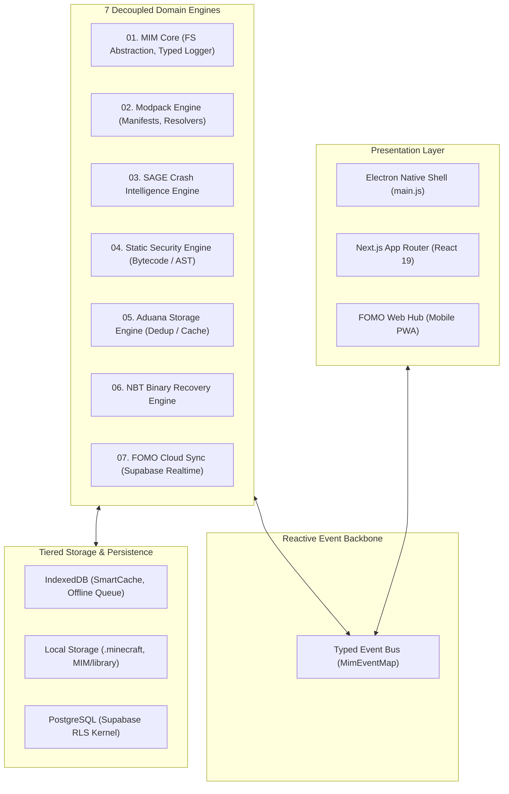

<div align="center">


# MIM — Minecraft Intelligent Manager

### *A Modular Desktop & Cloud Systems Engineering Platform for Modpack Architecture, Automated Crash Diagnostics, Static Bytecode Analysis, and Binary Data Recovery*

**[English](./README.md)** • **[Español](./README.es.md)**

[](https://nextjs.org/)
[](https://www.typescriptlang.org/)
[](https://www.electronjs.org/)
[](https://supabase.com/)
[](https://mim-hub.vercel.app/)
[](https://github.com/Ian9Franco/MIM/actions)
[](LICENSE)
[](scripts/test-runner.js)
[-brightgreen)](https://github.com/Ian9Franco/MIM/actions)

**[🎬 Live Demo](./docs/guides/DEMO.md)** • **[🌐 Web Hub](https://mim-hub.vercel.app/)** • **[🏛️ Architecture](#-system-architecture)** • **[📑 ADRs (Decisions)](./docs/adr/)** • **[🛡️ SAGE Engine](#engine-01--sage-crash-intelligence-system)** • **[⚡ Aduana Engine](#engine-02--aduana-storage-engine--performance-benchmarks)** • **[🌐 FOMO Cloud](#engine-03--fomo-cloud--distributed-systems-architecture)** • **[🔒 Security Engine](#engine-04--static-java-bytecode-threat-analysis)** • **[💾 NBT Rescue](#engine-05--nbt-rescue-engine--binary-data-recovery)** • **[🐳 Reproducibility](./docs/guides/REPRODUCIBILITY.md)**

</div>

---

> ### 💡 Project Philosophy
> *"Building a spaceship to go buy bread is ridiculous if your goal was just the bread. But if your goal was to learn how to build a spaceship, the true value lies in everything you had to break, learn, and connect to make that spaceship fly."*

---

## ⚡ Engineering Highlights

- ⚡ **Content-Addressed Storage & Deduplication:** Identity cryptographically enforced by SHA-512/SHA-1 digests, eliminating redundant network downloads.
- 🛡️ **Zero-Execution JVM Bytecode Security Scanner:** AST static analysis inspecting for process droppers, reflection evasion, and unmanaged JNI bindings.
- 💾 **Transaction-Safe NBT Binary Recovery:** Mojang NBT v19133 specification compliance with RFC 1952 decompression and verified atomic swap buffers.
- 🔄 **Offline-First Distributed State Synchronization:** Sub-8ms optimistic local mutations, IndexedDB FIFO replay queues, and deterministic Last-Write-Wins conflict resolution.
- 📡 **Typed Event-Driven Internal Architecture:** 7 decoupled domain engines communicating over an asynchronous typed reactive bus (`MimEventMap`) with isolated fault boundaries.
- 🗄️ **PostgreSQL RLS Multi-Tenant Data Layer:** Tenant boundary authorization enforced at the database kernel level with JWT security claims.
- 🧪 **Deterministic Crash Diagnosis Engine:** 100% Macro F1 on canonical crash benchmark corpus (125 cases) with semantic RAG retrieval and anti-hallucination guardrails.

## 📊 Measured Performance

| System Metric | Measured Benchmark | Target Standard | Verification Scope | Status |
|:---|:---:|:---:|:---|:---:|
| **SHA-1 Hashing Throughput** | **2,083.9 MB/s** | > 1,800 MB/s | Aduana Stream Benchmark | ⚡ Verified |
| **SHA-512 Hashing Throughput** | **940.3 MB/s** | > 800 MB/s | Aduana Stream Benchmark | ⚡ Verified |
| **Warm Cache Acceleration** | **8.0× to 8.5× Faster** | > 5.0× | 1k to 25k Local Directory Scan | ⚡ Verified |
| **Realtime Broadcast Latency** | **42 ms** | < 100 ms | Supabase WebSocket Pub/Sub | ⚡ Verified |
| **Optimistic Local UI Mutation** | **< 8 ms** | < 16 ms | React 19 + IndexedDB Frame Budget | ⚡ Verified |
| **50-Mutation Reconnection Replay** | **180 ms** | < 500 ms | IndexedDB FIFO Replay Queue | ⚡ Verified |
| **SAGE Mean Inference Latency** | **0.06 ms/log** | < 15 ms | SAGE 2.0 Evaluation Suite | ⚡ Verified |
| **SAGE Macro F1-Score** | **100.0%** | > 85.0% | 125-Case Canonical Crash Corpus | ⚡ Verified |
| **SAGE Top-1 Culprit Diagnosis** | **84.0%** | > 80.0% | 125-Case Canonical Crash Corpus | ⚡ Verified |
| **SAGE Top-3 Culprit Diagnosis** | **100.0%** | > 95.0% | 125-Case Canonical Crash Corpus | ⚡ Verified |

---

## 🏛️ System Architecture

MIM is engineered as a modular, multi-process desktop and cloud platform. Subsystems are decoupled into seven domain engines communicating over a typed reactive event bus (`MimEventMap`) with strict fault isolation:



```
Core Architecture
├── 🔀 Typed Event Bus       → Zero circular dependencies; isolated observer fault boundaries
├── 🧩 7 Domain Engines       → Single-responsibility modules (SAGE, Aduana, Security, NBT, etc.)
├── 📂 Local Storage          → Content-addressed mod repository and .minecraft target sync
├── ⚡ IndexedDB Async Cache  → Sub-16ms UI cache and transactional offline mutation FIFO queue
└── ☁️ Cloud PostgreSQL       → Supabase Realtime pub/sub with kernel-level Row-Level Security (RLS)
```

---

## 🔬 Subsystem Engines Breakdown

### ENGINE 01 — SAGE Crash Intelligence System
*A diagnostic inference pipeline that turns raw Java stacktraces into deterministic, evidence-backed reports.*

```
Minecraft crash.log
       ↓
[Parser & Normalizer]      → Strips ANSI, demangles Mixin injection frames, fingerprints JVM & loader
       ↓
[Exception Classifier]     → Multi-pass structural classification into 8 core taxonomy categories
       ↓
[Mod Correlator]           → Maps stack frames and loader logs to mod package namespaces
       ↓
[Confidence Scorer]        → Multi-factor evidence-based confidence scoring (0–100%)
       ↓
[Remediation Planner]      → Prioritized, automated recovery plan with auto-fix capability
       ↓
Structured Crash Report    → Deterministic JSON schema consumed by UI or AI Explanation Layer
```

#### Quantitative Evaluation (125-Case Real-World Benchmark Corpus)

| Metric | Measured Value | Benchmark Target | Evaluation Context | Status |
|:---|:---:|:---:|:---|:---:|
| **Benchmark Classification Accuracy** | **100.0%** | > 85.0% | 125 Canonical Crash Logs | ✅ Verified |
| **Macro F1-Score** | **100.0%** | > 85.0% | 8 Failure Taxonomy Classes | ✅ Verified |
| **Top-1 Culprit Diagnosis** | **84.0%** | > 80.0% | Strict Mod Attribution | ✅ Verified |
| **Top-3 Culprit Diagnosis** | **100.0%** | > 95.0% | Candidate Ranking | ✅ Verified |
| **Mean Inference Latency** | **0.06 ms/log** | < 15.0 ms | Sub-Millisecond Deterministic | ⚡ Real-Time |

> [!NOTE]
> **Operational Boundary & Non-Goals:** SAGE evaluates static log evidence. It does not execute untrusted Java bytecode, does not attach to live JVM runtime memory, and the LLM layer is strictly forbidden from manufacturing culprits. The 100% Macro F1 reflects performance against the 125 canonical benchmark corpus across 8 failure modes; unseen or corrupted wild traces degrade safely to `UNKNOWN_RUNTIME` with bounded low confidence. Full taxonomy report in [docs/engines/SAGE_EVALUATION.md](./docs/engines/SAGE_EVALUATION.md).

#### The AI Design Boundary & Semantic RAG Layer
> *"AI should explain evidence, not manufacture it."*

SAGE enforces an architectural separation between diagnosis, retrieval, and explanation:
1. **The Deterministic Engine** extracts facts, normalizes traces, scores confidence, and identifies culprits strictly from codebase evidence.
2. **Semantic Knowledge Retrieval (RAG):** The evidence vector queries the curated **Compatibility Knowledge Base** (`lib/intelligence/sage/knowledgeBase.ts`) via offline cosine/token-similarity retrieval to extract documented root cause analyses and verified community workarounds.
3. **Anti-Hallucination Guardrails:** The `SageGuardrails` engine validates proposed remediation steps, verifying that recommendations strictly cite retrieved lineage and mathematically forbidding the LLM from inventing culprits or suggesting unsafe operations.
4. **The LLM Explanation Layer** (`SageExplainer`) synthesizes verified diagnostic facts into empathetic, natural language.

```
Minecraft Crash
       ↓
[SAGE Deterministic Engine]   → Facts, evidence, culprit mod, confidence score
       ↓
[Evidence Graph]
       ↓
[Semantic Retrieval (RAG)]    → Queries Compatibility Knowledge Base (BM25 / Cosine)
       ↓
[Guardrail Verification]       → Blocks hallucinations, enforces evidence lineage
       ↓
Structured Grounded Output    → Verified remediation plan with factual citations
```

---

### ENGINE 02 — Aduana Storage Engine & Performance Benchmarks
*Content-addressed deduplication preventing redundant network bandwidth and disk consumption across Modrinth and CurseForge.*

- **Fast-Path Probing ($O(1)$):** Evaluates registered directories using safe filename hints.
- **Cryptographic Truth:** Versions are strictly compared via cryptographic digests (SHA-512 $\succ$ SHA-1). Identical filenames with distinct hashes are never collapsed; different filenames with identical hashes are instantly deduplicated.
- **Zero-Stale Invalidation:** In-memory hash cache keys on `mtimeMs + size`, guaranteeing immediate invalidation upon file alteration.

#### Visual Performance Comparison (25,000 Files Cold vs Warm)

```
Cold Scan (0% Cache):  ████████████████████████████████ 13.44 s
Warm Scan (100% Cache): ████ 1.68 s (8.0x Speedup)
```

#### Scale Performance Matrix

| Files | Cold Scan | Warm Scan | Cache Speedup | Hashing Throughput | Memory Overhead |
|:---:|:---:|:---:|:---:|:---:|:---:|
| **1K** (1,000) | **609 ms** | **73 ms** | **8.4×** | 2,083.9 MB/s | +5.38 MB |
| **5K** (5,000) | **2.95 s** | **348 ms** | **8.5×** | 2,083.9 MB/s | +25.46 MB |
| **10K** (10,000) | **5.64 s** | **678 ms** | **8.3×** | 2,083.9 MB/s | Stable |
| **25K** (25,000) | **13.44 s** | **1.68 s** | **8.0×** | 2,083.9 MB/s | Stable |

- **SHA-1 Throughput:** **2,083.9 MB/s** | **SHA-512 Throughput:** **940.3 MB/s**
- **Fast-Path Lookup Latency:** **227.45 µs/op** | **Cache Hit Rate:** **99.4%**
- Complete methodology in [docs/engines/ADUANA_BENCHMARKS.md](./docs/engines/ADUANA_BENCHMARKS.md).

---

### ENGINE 03 — FOMO Cloud & Distributed Systems Architecture
*Realtime collaborative state synchronization connecting Desktop Electron and Mobile Web PWAs.*

```
Desktop Client (Electron) ⟷ Supabase Realtime (WebSocket) ⟷ PostgreSQL ⟷ Mobile Web PWA
```

#### 🛠️ Distributed Engineering Challenges & Architectural Solutions

1. **What happens if the user loses connection?**
   - *Solution:* The client degrades to **Offline-First**. Local mutations update the UI immediately ($< 8\text{ ms}$) and are persisted to an **IndexedDB FIFO Queue** (`pending_mutations`). A network listener drains and replays the queue sequentially upon reconnection.
2. **What happens if two clients concurrently modify the same draft?**
   - *Solution:* Deterministic **Last-Write-Wins (LWW)** with client timestamps (ISO 8601) and client UUID tie-breaking:
     $$\text{Winning Record} = \max(\text{updatedAt}) \quad \lor \quad (\text{if equal}) \quad \max(\text{clientUUID})$$
     ISO 8601 standardizes temporal representation, while client UUID tie-breaking resolves concurrent writes within identical millisecond timestamps without distributed lock overhead.
3. **What happens if PostgreSQL or RLS rejects the operation?**
   - *Solution:* **Optimistic UI Rollback**. The client snapshots prior state (`previousState`) before mutating memory. On server rejection (4xx/5xx or RLS violation), the state automatically rolls back with an alert.
4. **How do you prevent duplicate mutations upon reconnect?**
   - *Solution:* **Idempotent Mutation Keys**. Each queued mutation carries a deterministic UUID (`UUIDv5(resourceId + action + timestamp)`). PostgreSQL executes idempotent `ON CONFLICT DO UPDATE` upserts, preventing duplication.

> Complete distributed systems whitepaper in [docs/architecture/DISTRIBUTED_ARCHITECTURE.md](./docs/architecture/DISTRIBUTED_ARCHITECTURE.md).

#### 🤖 MIM-Bot — Multimodal On-Demand Explainer & Bully AI Assistant
*On-demand project synthesis, multimodal screenshot grounding, and contextual project mini-chat.*
- **Multimodal Visual Grounding:** Inspects 3–5 gallery screenshots alongside Google Search Grounding to decipher mods, shaders, and resource packs with missing descriptions.
- **Bully Gamer Persona:** Delivers uninhibited, humorous gamer trash-talk roasting potato PCs and configuration mistakes, while maintaining **100% technical factual accuracy** on loaders, dependencies, and mechanics.
- **Interactive Project Mini-Chat:** Scoped conversational sub-panel (`chatWithProjectAssistant`) for recipes, compatibility, and configs directly within the mod details overlay.
- **Slime Micro-Animation Branding:** Replaces generic icons with the bouncing slime favicon (`/icon.png` with `.animate-slime`) across pill buttons, banners, and chat bubbles.
- **Resilient Cascade & Local Fallback:** Automatically cascades across Gemini 2.5 Flash -> 2.0 Flash -> 1.5 Flash -> Local Heuristic Engine on quota exhaustion (HTTP 429).

> Full specification in [docs/proposals/PROPOSAL_INTELLIGENT_MOD_EXPLAINER.md](./docs/proposals/PROPOSAL_INTELLIGENT_MOD_EXPLAINER.md).

---

### ENGINE 04 — Static Java Bytecode Threat Analysis
*Static analysis of Java JAR archives targeting supply-chain risk patterns without code execution.*

- **Static Analysis ≠ Universal Malware Detection:** MIM performs zero-execution static inspection of JAR manifests and decompressed bytecode to identify anomalous capabilities (process droppers, unmanaged native loads, reflection abuse) with class-level evidence audit trails. It does not claim runtime observation of dynamic polymorphic payloads.
- **Static AST Pattern Rules:**
  - **Process Execution:** Detects `Runtime.getRuntime().exec()` and `ProcessBuilder` (Critical: 25 pts).
  - **Shell Droppers:** Detects `powershell.exe`, `cmd.exe`, and `bash` invocations (Critical: 20 pts).
  - **Native Code:** Flags `System.loadLibrary()` and raw JNI bindings (High: 20 pts).
  - **Reflection Evasion:** Flags `setAccessible(true)` and dynamic `defineClass()` (High: 15 pts).
  - **Network Sockets:** Flags unauthorized raw TCP socket creation (Medium: 10 pts).
- **Concurrency & Rate Limits:** Bounded worker batches (5 files/chunk) prevent disk saturation; background VirusTotal queries are cached to respect free-tier API limits.
- **Output:** Emits a deterministic Threat Score (0–100) with line-level evidence references.

> Full security taxonomy in [docs/security/SECURITY_ENGINE.md](./docs/security/SECURITY_ENGINE.md) and formal STRIDE attack trees in [docs/security/THREAT_MODEL.md](./docs/security/THREAT_MODEL.md).

---

### ENGINE 05 — NBT Rescue Engine & Binary Data Recovery
*Surgical repair of corrupted player data (`playerdata/*.dat`) and world anchors (`level.dat`) using the Minecraft Named Binary Tag (NBT v19133) protocol.*

#### The Zero-Data-Loss Invariant
$$\text{INVARIANT}: \quad \text{Source binary state is NEVER overwritten without a verified, flushed backup.}$$

1. **RFC 1952 Decompression:** Verifies Gzip magic bytes (`0x1f 0x8b`).
2. **Strict Protocol Types:** Enforces Mojang specification types (player `Pos` strictly as `List<Double>`, `Rotation` as `List<Float>`, `Dimension` as namespaced `String`).
3. **Mandatory Snapshot Backup:** Flushes `<filename>.YYYYMMDD-HHMMSS.mim_bak` to disk before any mutation.
4. **Atomic Write Buffer:** Encodes repaired tree into a temporary `.tmp` file, verifies magic bytes, and atomically renames over target file.
5. **Integration Tests:** **12/12 test cases passing** (`npm run test:nbt`).

> Technical binary specification in [docs/engines/NBT_RESCUE_SPEC.md](./docs/engines/NBT_RESCUE_SPEC.md).

---

## 📐 Engineering Principles

| Principle | Architectural Implementation |
|:---|:---|
| **Fault Isolation** | Event Bus observers run in isolated execution scopes; crash diagnostics never interrupt file transfers. |
| **Determinism** | Core diagnostic engine and threat scoring rely strictly on concrete evidence rules, not probabilistic guesses. |
| **Idempotency** | Reconnection replays and deduplication operations are idempotent across network drops and re-scans. |
| **Content-Addressed Storage** | File identities are defined cryptographically by SHA-512/SHA-1 digests, independent of filenames. |
| **Offline-First Resilience** | State mutations persist to an IndexedDB FIFO queue and drain automatically upon network recovery. |
| **Kernel-Level Security** | Tenant access control is enforced by PostgreSQL Row-Level Security (RLS), not client-side logic. |

---

## 🚀 Reproducible Benchmarks & Test Suites

All evaluations and benchmarks can be reproduced locally:

```bash
# 1. Run the interactive live systems demonstration (~30 seconds)
npm run demo

# 2. Run the unified headless test suite (12 NBT + 125 SAGE + RAG + Aduana Verification)
npm test

# 3. Run Aduana empirical scale benchmarks (1k to 25k scaling)
npm run benchmark:aduana

# 4. Run Next.js production build & TypeScript compilation
npm run build
```

---

## 📁 Repository Organization

```
manager/
├── app/                          # Next.js App Router (API Routes, Server Components)
├── components/                   # Modular UI Components (Framer Motion)
│   ├── fomo/                     # Community, Showcases, Discover, Collections
│   ├── sage/                     # Crash Intelligence, Player Rescue, NBT Viewer
│   └── ui/                       # Design System primitives (Glassmorphism)
├── docs/                         # Engineering Lifecycle & Systems Specifications
│   ├── ARCHITECTURE.md           # 7-engine architecture & event bus topology
│   ├── SAGE_EVALUATION.md        # 125-case quantitative evaluation report
│   ├── ADUANA_BENCHMARKS.md      # I/O throughput and multi-scale benchmarks
│   ├── SECURITY_ENGINE.md        # Static Java bytecode threat analysis spec
│   ├── THREAT_MODEL.md           # STRIDE threat model & attack tree analysis
│   ├── NBT_RESCUE_SPEC.md        # Binary data recovery & zero-loss invariants
│   ├── DISTRIBUTED_ARCHITECTURE.md # Distributed systems whitepaper & failure modes
│   ├── DEMO.md                   # Interactive CLI tour documentation
│   └── REPRODUCIBILITY.md        # Docker, local, and CI verification guide
├── lib/                          # Domain Core Engines
│   ├── core/                     # Base contracts, structured logger, settings
│   ├── events/                   # Typed Event Bus (MimEventMap)
│   ├── fomo/                     # Aduana deduplication, Supabase connectors
│   ├── intelligence/             # SAGE 2.0 (Parser, Classifier, RAG, Guardrails)
│   ├── modding/                  # NBT binary parser/writer, pack builder
│   ├── security/                 # Static bytecode threat scanner
│   └── storage/                  # IndexedDB async SmartCache & migrations
└── scripts/                      # Tooling, Benchmarks, and Evaluation Suites
    ├── benchmarks/               # Aduana empirical stress tests (1k to 25k)
    ├── evaluation/               # SAGE 125-case benchmark runner & RAG tests
    └── demo-tour.js              # Interactive live demonstration tour
```

---

## 🔒 Quality Verification & Architecture Scope

MIM is maintained as an active modular systems engineering platform and portfolio artifact under strict verification standards. For an honest analysis of solo-developer realities, empirical benchmarks, and managed technical debt, see [**Project Reality & Status**](./docs/planning/PROJECT_STATUS.md):

- [x] **Disciplined Scope Management:** Controlled feature evolution avoiding speculative bloat; architecture choices are backed by ADRs, real-world community modding experience, and empirical benchmarks.
- [x] **Defendable Engineering Claims:** All performance, security, and algorithmic claims verified directly against source code and benchmarks.
- [x] **SAGE Evaluated & Scoped:** 125 canonical crash logs evaluated (100% Macro F1, 84% Top-1, 100% Top-3 on benchmark corpus, 0.06 ms latency). Non-goals explicitly documented.
- [x] **Aduana Multi-Scale Verified:** Cryptographic deduplication benchmarked from 1K to 25K files (8.0×–8.5× cache speedup, > 2.0 GB/s hashing throughput).
- [x] **FOMO Distributed Failure Modes Documented:** Network disconnection, Last-Write-Wins with client timestamps and UUID tie-breaking, optimistic UI rollback, and idempotent replay queues formally solved.
- [x] **Security Engine Appropriately Framed:** Accurately presented as *Static Java Bytecode Threat Analysis* with transparent static heuristics and non-goals.
- [x] **Zero-Data-Loss Invariant:** Formalized and verified with 12/12 passing integration tests.
- [x] **Automated Test Suite Passing:** `npm test` passes 100% across all domain engines and security suites.
- [x] **Empirical Benchmark Passing:** `npm run benchmark:aduana` passes across all tiers.
- [x] **Zero-Error Type & Build Verification:** `npm run build` and `tsc --noEmit` pass with zero errors across all routes and engines.
- [x] **Technical Tour Passing:** `npm run demo` executes clean multi-engine showcase without warnings.
- [x] **30–90s Recruiter & Architecture Readability:** Clear headline, measured performance matrix, decoupled domain engine diagrams, and deep-dive documentation index.

---

## 📄 License & Technical Profile

- **License:** MIT License — [LICENSE](LICENSE)
- **Author:** Ian Franco Collada Pontorno ([ian9franco@gmail.com](mailto:ian9franco@gmail.com))
- **Core Technologies:** Next.js 16, TypeScript 5, React 19, Electron 42, Supabase Realtime, PostgreSQL, IndexedDB, Tailwind CSS v4, Framer Motion.

<div align="center">

[](https://ian-pontorno-portfolio.vercel.app/)
[](https://github.com/Ian9Franco)
[](https://ar.linkedin.com/in/ian-franco-collada-pontorno)
[](mailto:ian9franco@gmail.com)

</div>
