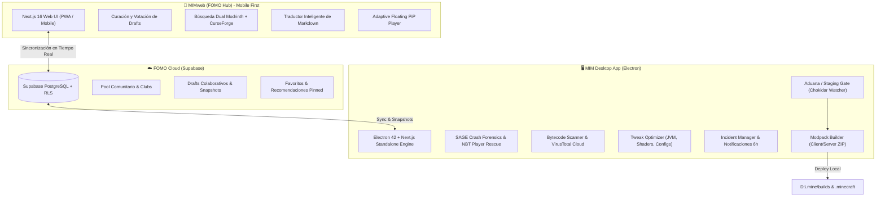

<div align="center">


# Minecraft Intelligent Manager (MIM)

### *El ecosistema definitivo para organizar, optimizar y colaborar en tus modpacks de Minecraft*

> **No pierdas mods, no rompas mundos, no sufras depurando crashes.**  
> Gestiona tu librería en el escritorio, descubre y cura mods desde tu móvil con **MIMweb**,  
> y colabora en tiempo real con la comunidad a través de **FOMO Cloud**.

[](https://nextjs.org/)
[](https://react.dev/)
[](https://www.electronjs.org/)
[](https://www.typescriptlang.org/)
[](https://tailwindcss.com/)
[](https://supabase.com/)
[](README.md)
[](LICENSE)

**[✨ Modos de Uso](#-los-3-modos-de-operación)** • **[🌐 Ecosistema](#-arquitectura-del-ecosistema)** • **[📱 MIMweb / FOMO Hub](#-mimweb--fomo-hub-mobile-first)** • **[🛡️ SAGE & Seguridad](#-sage-engine--seguridad-integral)** • **[🔔 Alertas & Sync](#-sistema-de-alertas-notificaciones-y-background-sync)** • **[🎨 UI, Sonidos & FX](#-experiencia-visual-micro-animaciones-y-sonidos)** • **[🚀 Quick Start](#-instalación-y-desarrollo)**

</div>

---

> [!NOTE]
> ### 📦 Estado del Proyecto: En Desarrollo Activo (v10.4.0)
> MIM cuenta con una base funcional y operativa tanto en su aplicación de escritorio (**MIM Desktop** en Electron 42 + Next.js) como en su interfaz web móvil (**MIMweb / FOMO Hub** con Supabase). Los módulos principales de clasificación, aduana, diagnóstico SAGE, escáner de seguridad y sincronización en la nube se encuentran implementados y en proceso de iteración, pruebas y refinamiento continuo.

---

## 🎯 ¿Qué es MIM?

**MIM (Minecraft Intelligent Manager)** no es un simple launcher: es una suite de ingeniería, organización y descubrimiento de modpacks diseñada para eliminar por completo la fricción de gestionar cientos de mods, configuraciones y versiones.

Combina una potente aplicación de escritorio nativa (**Electron 42** + **Next.js 16 / React 19**), una plataforma comunitaria en la nube (**FOMO Cloud** con Supabase) y una interfaz web diseñada específicamente para dispositivos móviles (**MIMweb / FOMO Hub**).

### ❌ **El caos tradicional**
- Cientos de archivos `.jar` dispersos sin orden ni clasificación de versión o loader.
- Conflictos invisibles entre mods de cliente y mods de servidor.
- Crashes crípticos al iniciar y mundos perdidos por datos NBT o entidades corruptas.
- Sin forma de buscar, traducir descripciones o armar listas de mods de forma remota mientras estás lejos de tu PC.

### ⚡ **La solución con MIM**
- **Clasificación fulminante**: Categoriza mods en milisegundos con hotkeys `1-9` o deja que el clasificador heurístico lo haga por ti.
- **Detección y deduplicación automática (Aduana)**: Monitoreo en vivo de descargas con Chokidar y almacén de caché local unificada.
- **Diagnóstico heurístico y rescate (SAGE)**: Diagnóstico automático de stacktraces y editor NBT visual para rescatar jugadores atrapados.
- **Ecosistema Multiplataforma**: Arma modpacks en el móvil con **MIMweb**, traduce descripciones al instante, sincroniza en tiempo real mediante **FOMO Cloud** y compila en 1 clic en **MIM Desktop**.

---

## 🕹️ Los 3 Modos de Operación

MIM se adapta al tipo de usuario y al flujo de trabajo actual mediante 3 modos principales:

```
┌─────────────────────────────────────────────────────────────────────────────┐
│                              MODOS DE OPERACIÓN                             │
├─────────────────────────┬─────────────────────────┬─────────────────────────┤
│   🛠️ MODO MIM (Maker)   │    🎮 MODO MIMU (User)  │   ☁️ FOMO CLOUD & WEB   │
├─────────────────────────┼─────────────────────────┼─────────────────────────┤
│ Para creadores de packs │ Para jugadores casuales │ Para descubrir y curar  │
│ • Proyectos y perfiles  │ • Instalación directa   │ • Sincronización nube   │
│ • Separación Client/Srv │   en .minecraft/mods    │ • Drafts colaborativos  │
│ • Build ZIP optimizado  │ • Gestor de mundos      │ • MIMweb Mobile-First   │
│ • Control de modloaders │ • Mods activos / inact. │ • Showcases de YouTube  │
└─────────────────────────┴─────────────────────────┴─────────────────────────┘
```

1. **🛠️ Modo MIM (Modpack Maker)**: Orientado a creadores de modpacks. Ofrece control granular por categoría (Esenciales, Client-only, Servidor, Rendimiento), resolución estricta de dependencias cruzadas y compilación de ZIPs listos para distribución.
2. **🎮 Modo MIMU (User Mode)**: Modo directo para jugadores que solo quieren probar o instalar mods en su `.minecraft` local sin lidiar con estructuras de proyectos complejas.
3. **☁️ FOMO Cloud & MIMweb**: La capa social y remota. Permite interactuar con la comunidad, descubrir mods a través de videos de creadores y trabajar en borradores de modpacks desde el móvil.

---

## 🌐 Arquitectura del Ecosistema

MIM conecta de forma sincronizada la potencia local de la app de escritorio con la flexibilidad de la nube y la web móvil:



---

## 📱 MIMweb / FOMO Hub (Mobile-First)

**MIMweb** (ubicado en [`web/`](file:///d:/Dev/CodeProjects/MIM/web)) es la versión web de MIM creada para que puedas seguir trabajando en tus modpacks en cualquier momento y lugar desde tu teléfono o tablet:

- 📲 **Diseño Táctil y Mobile-First**: Interfaz reactiva y optimizada para gestos táctiles construida con **Next.js 16**, **React 19** y **Framer Motion**.
- 🔍 **Búsqueda Dual Simultánea**: Consulta en paralelo los catálogos de **Modrinth** y **CurseForge** a través de un proxy backend seguro con validación de hashes SHA-1.
- 🌐 **Traducción Inteligente en Vivo**: Endpoint dedicado `/api/fomo/translate` que traduce descripciones y changelogs de inglés a español respetandoviñetas, listas e indentación de Markdown/HTML sin romper el diseño.
- 📑 **Inspección de Dependencias y Entornos**:
  - Clasificación clara de dependencias: *Obligatorias*, *Opcionales* e *Incompatibles*.
  - Detección precisa de entornos (*Client-side*, *Server-side* o *Both*).
- 🎬 **Showcase Floating Player**:
  - Reproductor picture-in-picture nativo para showcases de YouTube.
  - Aislamiento de eventos gestuales táctiles (`touch-action: none`) para arrastrar el reproductor libremente sin bloquear el scroll.
  - Fallback automático e instantáneo con botón *"Abrir en YouTube"*.
- 🔄 **Flujo de Trabajo Remoto a Escritorio**: Crea o modifica un *Draft* en el móvil ➔ Sincroniza con FOMO Cloud ➔ Abre MIM Desktop en tu PC ➔ Compila el modpack listo para jugar con 1 clic.

---

## ☁️ FOMO Cloud (Comunidad y Colaboración)

Respaldado por **Supabase**, FOMO Cloud transforma la experiencia solitaria de crear modpacks en un entorno colaborativo:

- 🤝 **Drafts Colaborativos en Tiempo Real**: Crea modpacks en conjunto con amigos, vota adiciones, ajusta loaders/versiones y genera *Snapshots* definitivas.
- 🌟 **Pool Comunitario & Perfiles Públicos**: Comparte tus mods favoritos, marca recomendaciones destacadas (*pinned*), únete a clubs temáticos y explora colecciones de otros creadores.
- 📺 **Showcases de Creadores de Contenido**: Sigue canales de YouTube directamente en MIM; el sistema extrae automáticamente los mods mostrados en los videos para que los agregues a tu biblioteca sin buscarlos manualmente.
- 🛡️ **Seguridad y Hardening**: Políticas de Row Level Security (RLS) estrictas, sanitización profunda de HTML externo (`sanitizeHtml`) y endpoints protegidos.

---

## 🔔 Sistema de Alertas, Notificaciones y Background Sync

MIM cuenta con una arquitectura de diagnóstico e incidentes reactiva conectada al bus de eventos interno (`lib/events/eventBus.ts`):

- 🚨 **Incident Manager Reactivo**: Centraliza y persiste alertas del sistema según su severidad (`info`, `warning`, `critical`).
- 📡 **Eventos Automatizados**:
  - `sage:crash-detected` ➔ Diagnóstico inmediato tras un fallo de Minecraft.
  - `sage:security-risk` / `virustotal:completed` ➔ Notificación de archivos sospechosos o limpios.
  - `builder:validation-completed` ➔ Validación de dependencias y conflictos de modloaders.
- 🔄 **Background Sync de Creadores y Autores**: Tarea en segundo plano con intervalo de 6 horas que comprueba nuevos lanzamientos de autores seguidos y nuevos videos de canales registrados, encendiendo insignias de notificación (*unread badges*).
- 🩺 **Monitor de Rutas y APIs**: Comprobación periódica de integridad de rutas de disco (`Downloads`, `Source`, `Builds`) y disponibilidad de tokens de API.

---

## 🛡️ SAGE Engine & Seguridad Integral

### 🧠 **SAGE Engine (Crash Forensics & Recovery)**
- **Análisis Heurístico de Logs**: Inspecciona `latest.log`, `crash-reports` y stacktraces de Forge, Fabric, NeoForge y Quilt.
- **Diagnóstico Preciso**: Te indica con exactitud qué `.jar` o incompatibilidad de mixin causó el fallo.
- **1-Click Auto-Recovery**: Detecta librerías ausentes y las descarga automáticamente.
- **SAGE Player & World Rescue**:
  - Editor visual de datos **NBT** para archivos de jugador (`playerdata/*.dat`) y mundos (`level.dat`).
  - Permite teletransportar al jugador a coordenadas seguras, cambiar dimensiones, editar vida/inventario o remover entidades corruptas que crashean chunks.

### 🔒 **Security Scanner (Threat Detection)**
- **Análisis de Bytecode Local**: Desensambla y escanea clases en `.jar` y `.zip` buscando llamadas sospechosas a sockets, webhooks de Discord, scripts ofuscados o firmas de RATs/malware.
- **Integración con VirusTotal Cloud**: Verificación masiva de hashes SHA-1 / SHA-256 en la API de VirusTotal.
- **Badges de Integridad**: Clasificación visual en 3 estados: `✅ Safe`, `⚠️ Suspicious`, `🔴 Malicious`.

---

## 🎹 Tweak Optimizer & JVM Tuning

- 🚀 **Asignador de JVM Inteligente**: Calcula la memoria RAM óptima y selecciona las flags de Garbage Collector más convenientes para tu CPU y GPU (**G1GC**, **ZGC** o **Shenandoah**).
- 🎨 **Tweak Overrides de Resource Packs**: Permite forzar la carga de paquetes de texturas marcados como incompatibles por el juego escribiendo directamente en `options.txt` (`incompatibleResourcePacks`).
- 🌈 **Gestor de Shaders**: Detección y orden de shaderpacks compatibles con Iris y OptiFine.
- ⚙️ **Config Explorer**: Visualizador y editor integrado para los archivos `.cfg` y `.json` dentro de `.minecraft/config`.

---

## 🎨 Experiencia Visual, Micro-Animaciones y Sonidos

- 🎵 **Sistema de Sonido No Bloqueante (`lib/sounds.ts`)**: Feedback sonoro sutil al interactuar con la app (`playFomoSound`), con sistema de precarga, audio pools para evitar solapamientos, control de volumen maestro y opción de silenciado.
- ⚡ **Animaciones a 60 FPS**: Transiciones fluidas impulsadas por **Framer Motion**, desenfoques de fondo estilo *glassmorphism* (`backdrop-blur`) y marquesinas suaves de texto (`useSmoothMarquee`).
- 📜 **Virtual Scrolling de Alto Rendimiento**: Renderizado masivo con `react-window` que permite navegar listas de más de **1,000 mods** sin pérdida de fluidez.
- 🧍 **Visor 3D de Skins (`skinview3d`)**: Previsualizador tridimensional interactivo para skins y capas del jugador dentro de la interfaz.
- 🌓 **Sistema de Temas**: Soporte para Modo Oscuro inmersivo, Modo Claro y adaptación al tema del sistema operativo.

---

## 🎓 Onboarding & Tutorial Interactivo

- 🧭 **Tour Guiado para Nuevos Usuarios (`OnboardingTour.tsx`)**: Asistente interactivo paso a paso con efecto de foco dinámico (*spotlight*) que resalta cada área clave de la interfaz mediante `getBoundingClientRect` y desplazamiento suave automático.
- 💡 **Explicaciones Claras**: Enseña a clasificar mods con hotkeys, usar la bandeja de Aduana y compilar tu primer proyecto en menos de 3 minutos.

---

## ⌨️ Atajos de Teclado (Desktop)

| Atajo | Acción | Descripción |
|:---|:---|:---|
| **`1` – `9`** | Clasificar mod | Asigna el mod seleccionado a la categoría activa (~0.3s) |
| **`Space`** | Previsualizar | Abre la ficha técnica del mod, changelogs y dependencias |
| **`Delete` / `Backspace`**| Desclasificar | Devuelve el mod a la bandeja de entrada sin categorizar |
| **`Ctrl + B`** | Build Project | Compila el modpack activo y genera el archivo ZIP optimizado |
| **`F`** | Toggle FOMO | Abre/cierra instantáneamente el panel de FOMO Cloud |
| **`Ctrl + F`** | Búsqueda rápida | Filtra los mods en pantalla en tiempo real |

---

## 🛠️ Arquitectura y Tecnologías

| Dominio | Tecnologías Principales | Propósito |
|:---|:---|:---|
| **Desktop Wrapper** | [Electron 42](https://www.electronjs.org/) + Node.js 20+ | Runtime nativo de escritorio para Windows (NSIS / Portable) |
| **Desktop UI / Backend**| [Next.js 16](https://nextjs.org/) (Turbopack) + [React 19](https://react.dev/) | Frontend reactivo de alto rendimiento y API routes locales |
| **MIMweb (FOMO Hub)** | [Next.js 16](https://nextjs.org/) + [React 19](https://react.dev/) + [Framer Motion](https://www.framer.com/motion/) | Web app Mobile-First para gestión y curación remota |
| **Estilos & UI** | [Tailwind CSS v4](https://tailwindcss.com/) + [Lucide Icons](https://lucide.dev/) | Diseño glassmorphism inmersivo con modo oscuro premium |
| **Cloud & Base de Datos**| [Supabase](https://supabase.com/) (PostgreSQL + RLS + Storage) | Sincronización en tiempo real de drafts, perfiles y favoritos |
| **Almacenamiento Local**| [IndexedDB (`idb`)](https://github.com/jakearchibald/idb) + LocalStorage | Persistencia asíncrona local de caché y configuración |
| **APIs Externas** | Modrinth Labrinth v2, CurseForge Eternal v1, VirusTotal v3 | Catálogos globales de mods, dependencias y seguridad |

---

## 📂 Estructura del Repositorio

```
MIM/
├── app/                  # Frontend y API Routes de MIM Desktop (Next.js 16)
│   ├── api/              # Endpoints locales:
│   │   ├── bedrock/      # Descubrimiento y compatibilidad Bedrock
│   │   ├── build/        # Compilador de modpacks ZIP
│   │   ├── classify/     # Clasificación rápida y categorías
│   │   ├── crosscheck/   # Verificación cruzada Modrinth/CurseForge
│   │   ├── fomo/         # Endpoints de proxy, traducción y caché social
│   │   ├── sage/         # Análisis de logs y rescate NBT
│   │   ├── security/     # Análisis de bytecode y VirusTotal
│   │   ├── tweak/        # Optimizador de JVM y options.txt
│   │   └── watcher/      # Monitoreo en tiempo real de descargas (Chokidar)
│   ├── page.tsx          # Vista principal de la app de escritorio
│   └── globals.css       # Tokens de diseño y estilos globales
├── components/           # Componentes modulares de escritorio
│   ├── alerts/           # Centro de incidentes y notificaciones
│   ├── fomo/             # Módulos de FOMO Cloud (community, discover, showcase, drafts)
│   ├── gate/             # Aduana y bandeja de importación
│   ├── library/          # Visor 3D de skins, tarjetas y detalles de mods
│   ├── projects/         # Gestor de modpacks y compilador
│   ├── sage/             # Interfaz forense de crashes y rescate NBT
│   ├── security/         # Analizador de amenazas y firmas
│   ├── tweak/            # Controles de rendimiento y explorador de configs
│   └── ui/               # OnboardingTour, modales, toasts y controles base
├── standalone/           # Proceso y empaquetado de Electron
│   ├── main.js           # Subproceso principal de Electron & Deep Linking
│   ├── prepare.js        # Script de preparación para standalone
│   └── scraper.js        # Scraper on-demand de colecciones
├── web/                  # MIMweb / FOMO Hub (Web App Mobile-First)
│   ├── app/              # Rutas, layouts y API proxy de la web app
│   ├── components/       # Componentes optimizados para interacción táctil
│   └── lib/              # Lógica de dependencias, entornos, sonidos y Supabase
├── lib/                  # Bibliotecas y lógica central de escritorio
│   ├── events/           # Event Bus y orquestación reactiva
│   ├── fomo/             # Servicios de nube y sincronización
│   ├── intelligence/     # Motores SAGE y gestor de incidentes
│   ├── modding/          # Scanner de archivos .jar, builder y validador
│   ├── security/         # Analizador estático de bytecode
│   └── storage/          # Persistencia IndexedDB y migración de datos
├── docs/                 # Documentación técnica exhaustiva
└── sql/                  # Esquemas maestros y migraciones de Supabase
```

---

## 🚀 Instalación y Desarrollo

### 📋 Requisitos Previos
- **Node.js**: v20.x o superior
- **npm** o **pnpm**
- **Git**

### 💻 1. Ejecutar MIM Desktop (App de Escritorio)

```bash
# 1. Clonar el repositorio
git clone https://github.com/Ian9Franco/MIM.git
cd MIM

# 2. Instalar dependencias
npm install

# 3. Iniciar en modo desarrollo web (Next.js)
npm run dev

# 4. Iniciar la aplicación nativa de escritorio completa (Electron)
npm run start:standalone
```

#### 📦 Compilar instalador ejecutable para Windows (`.exe` NSIS / Portable):
```bash
npm run package:win
```
*Los binarios compilados se guardarán en la carpeta `dist/`.*

---

### 📱 2. Ejecutar MIMweb / FOMO Hub (Versión Web Móvil)

```bash
# 1. Entrar al directorio web
cd web

# 2. Instalar dependencias
npm install

# 3. Iniciar servidor de desarrollo en el puerto 3001
npm run dev

# 4. Abrir en tu navegador o smartphone en la misma red local
# http://localhost:3001
```

---

## ⚙️ Variables de Entorno y Configuración

Crea un archivo `.env.local` en la raíz del proyecto (y en `web/` si se ejecuta de forma independiente):

```env
# Supabase (FOMO Cloud)
NEXT_PUBLIC_SUPABASE_URL=https://tu-proyecto.supabase.co
NEXT_PUBLIC_SUPABASE_ANON_KEY=tu-anon-key

# APIs de Modding y Seguridad (Opcionales / Recomendadas)
CURSEFORGE_API_KEY=tu-api-key-de-curseforge
VIRUSTOTAL_API_KEY=tu-api-key-de-virustotal
MODRINTH_TOKEN=tu-token-de-modrinth

# Rutas del Workspace Local (Desktop)
MIM_SOURCE_BASE=D:\.mine\source
MIM_BUILDS_BASE=D:\.mine\builds
```

---

## 📁 Estructura del Workspace Local

Por defecto, MIM estructura tus archivos en `D:\.mine\` (totalmente configurable en la ventana de Ajustes):

```
D:\.mine\
├── source\                      # Almacén central de mods descargados
│   └── 1.20.1\
│       ├── forge\.essential\    # Mods esenciales clasificados
│       │   ├── tecnologia\
│       │   ├── fauna\
│       │   └── librerias\
│       ├── forge\.local\        # Mods de cliente (rendimiento, audio, etc.)
│       │   └── rendimiento\
│       └── common\              # Resource packs y shaders
├── builds\                      # Compilaciones ZIP listas para jugar
├── staging\                     # Bandeja de entrada de descargas
└── presets\                     # Plantillas y configuraciones por versión
```

---

## 📚 Documentación Técnica Detallada

| Documento | Descripción | Enlace |
|:---|:---|:---|
| 📖 **Arquitectura Maestra** | Diseño técnico integral y flujo de datos de MIM | [docs/MIM.md](docs/MIM.md) |
| ☁️ **FOMO Cloud** | Especificación técnica de la plataforma social y drafts | [docs/FOMO_CLOUD.md](docs/FOMO_CLOUD.md) |
| 🛡️ **Web Hardening** | Reglas de mantenimiento, Supabase y pruebas para MIMweb | [docs/WEB_HARDENING.md](docs/WEB_HARDENING.md) |
| 🧠 **SAGE & NBT Rescue** | Guía de diagnóstico heurístico y rescate NBT de jugadores | [docs/SAGE_RESCUE.md](docs/SAGE_RESCUE.md) |
| 🔌 **API Integration** | Referencia de integración con Modrinth, CurseForge y VirusTotal | [docs/API.md](docs/API.md) |
| 📝 **Changelog** | Historial de versiones y cambios implementados | [docs/CHANGELOG.md](docs/CHANGELOG.md) |
| 🗺️ **Roadmap** | Hoja de ruta y futuras características | [docs/ROADMAP.md](docs/ROADMAP.md) |

---

## 🤝 Contribuciones

Las contribuciones son bienvenidas. Si deseas colaborar:

1. Crea un fork del repositorio.
2. Crea tu rama para la funcionalidad: `git checkout -b feat/mi-nueva-feature`.
3. Sigue los estándares de TypeScript estricto y [Conventional Commits](https://www.conventionalcommits.org/).
4. Realiza commit de tus cambios: `git commit -m "feat: añade soporte para nuevo loader"`.
5. Envía tu pull request a la rama `main`.

---

## 📄 Licencia

Este proyecto está bajo la Licencia **MIT** — consulta el archivo [LICENSE](LICENSE) para más detalles.

---

<div align="center">

### 👨‍💻 Autor & Contacto

**Desarrollado con ☕ y pasión por [Ian Franco Collada Pontorno](https://github.com/Ian9Franco)**

[](https://ian-pontorno-portfolio.vercel.app/)
[](https://github.com/Ian9Franco)
[](https://ar.linkedin.com/in/ian-franco-collada-pontorno)
[](https://www.instagram.com/ian.franco._/)
[](mailto:ian9franco@gmail.com)

<br/>

*Transforma el caos de los mods en una experiencia simple, rápida y colaborativa.*

[🌟 Danos una Star en GitHub](https://github.com/Ian9Franco/MIM) • [💬 Comunidad y Discusiones](https://github.com/Ian9Franco/MIM/discussions) • [🐛 Reportar un Bug](https://github.com/Ian9Franco/MIM/issues)

</div>
