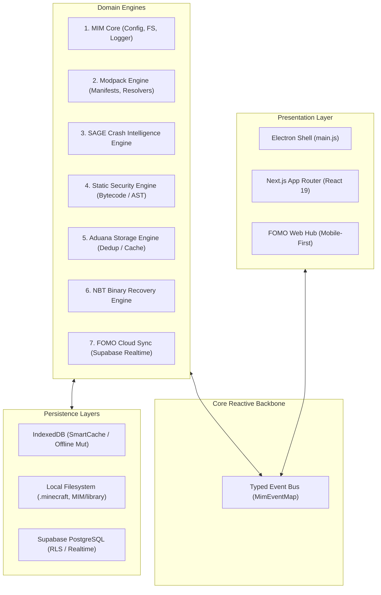

# MIM Systems Architecture & Engine Specification

> **Platform:** MIM — Minecraft Intelligent Manager  
> **System Scope:** Desktop (Electron + Next.js App Router), Realtime Cloud (Supabase + PostgreSQL), Mobile Web PWA  
> **Design Principles:** Single Responsibility, Event-Driven Fault Isolation, Content-Addressed Caching, Deterministic Diagnostic Inference.

---

## 🏛️ High-Level System Architecture

MIM is engineered around seven autonomous, decoupled engines communicating over a typed event bus and structured storage layers:

---

## 🧩 Engine Specifications & Boundaries

### 1. MIM Core Engine (`lib/core/`, `lib/events/`)
- **Responsibility:** Runtime configuration, file-system path normalization, structured error reporting, and typed event broker.
- **Contract:** All cross-engine communication flows through `MimEventMap` (`lib/events/eventContract.ts`), strictly avoiding direct circular dependencies between modules.
- **Fault Isolation:** Event listeners execute within isolated `try/catch` boundaries. Failure in an observer (e.g. analytics or UI badge refresh) never interrupts core filesystem operations.

### 2. SAGE Crash Intelligence Engine (`lib/intelligence/sage/`)
- **Responsibility:** Multi-stage diagnostic inference for Minecraft crashes and exceptions.
- **Pipeline:**
  $$\text{Raw Log} \xrightarrow{\text{Parser}} \text{Norm. Stack} \xrightarrow{\text{Classifier}} \text{Evidence} \xrightarrow{\text{Correlator}} \text{Culprit Mod} \xrightarrow{\text{Scorer}} \text{Report (JSON)}$$
- **Taxonomy:** Classifies into 8 standard categories: `MISSING_DEPENDENCY`, `VERSION_CONFLICT`, `MIXIN_FAILURE`, `JAVA_INCOMPATIBILITY`, `MOD_CONFLICT`, `CORRUPTED_WORLD`, `OUT_OF_MEMORY`, and `UNKNOWN_RUNTIME`.
- **AI Boundary:** The diagnostic engine is 100% deterministic. The optional AI layer (`SageExplainer`) acts exclusively as an empathetic translator of engine evidence into natural language; it is mathematically prevented from guessing or altering diagnosed causes.

### 3. Aduana Storage & Deduplication Engine (`lib/fomo/aduana.ts`)
- **Responsibility:** Content-addressed deduplication preventing redundant network downloads across Modrinth and CurseForge.
- **Guarantee:** Cryptographic verification is the sole truth (SHA-512 $\succ$ SHA-1). Same filename with different hash is treated as an independent file; different filenames with identical hashes are instantly deduplicated.
- **Performance:** Two-stage lookup. $O(1)$ fast filename-hint probing before falling back to full directory traversal, backed by an in-memory `mtimeMs + size` cache.

### 4. Static Security Engine (`lib/security/`)
- **Responsibility:** Static analysis of Java JAR archives without dynamic execution.
- **Inspection Pipeline:** Extracts ZIP manifests and decompresses `.class` bytecode to evaluate risk rules (process execution, native JNI calls, network sockets, reflection evasion, mass deletion).
- **Threat Scoring:** Emits a deterministic Threat Score (0–100) and an itemized evidence audit trail for AppSec analysis.

### 5. NBT Binary Recovery Engine (`lib/modding/nbt.ts`, `lib/intelligence/sageRecoveryEngine.ts`)
- **Responsibility:** Low-level binary decoding, validation, and safe repair of Minecraft `.dat` files (inventories, entities, coordinates).
- **Zero-Loss Invariant:** Original binary data is never mutated in-place. A verified `.mim_bak` snapshot is written to disk prior to any modification.

### 6. FOMO Distributed Sync Engine (`lib/fomo/`, Supabase)
- **Responsibility:** Bi-directional state synchronization between Desktop Electron clients and Mobile Web PWAs.
- **Conflict Strategy:** Deterministic Last-Write-Wins (LWW) utilizing client timestamps with client UUID tie-breaking and idempotent queue replays upon reconnection.
- **Security Boundary:** PostgreSQL Row-Level Security (RLS) ensures users can only mutate owned modpack drafts and collections.

### 7. UI / Presentation Layer (`app/`, `components/`)
- **Responsibility:** Modern, accessible user interface built with Next.js App Router, React 19, and Framer Motion micro-interactions.
- **Rule:** UI components contain zero business logic; they interact with engines exclusively via typed React hooks (`useSageManager`, `useFomoDownload`, `useSmartUpdates`).

---

## ⚡ Performance & Invariant Summary

| Subsystem | Core Metric | Architectural Guarantee |
|:---|:---:|:---|
| **SAGE 2.0** | **0.06 ms** inference latency | 100% deterministic taxonomy classification on benchmark corpus |
| **Aduana** | **> 1,800 MB/s** hashing throughput | Zero false deduplications (cryptographic SHA-512 / SHA-1) |
| **NBT Rescue** | **100%** round-trip fidelity | Atomic writes with mandatory `.mim_bak` snapshot |
| **Cloud Sync** | **< 100 ms** WebSocket latency | Offline mutation persistence in IndexedDB |
