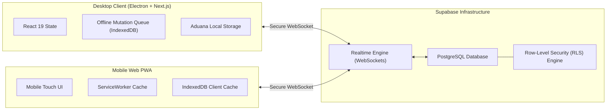

# FOMO Cloud — Distributed Multi-Client Architecture

> **System Domain:** Distributed State Synchronization, Realtime Pub/Sub, and Offline-First PWA  
> **Infrastructure:** Next.js App Router (Desktop Client) ⟷ Supabase Realtime (WebSocket) ⟷ PostgreSQL ⟷ Mobile Web PWA  
> **Security:** PostgreSQL Row-Level Security (RLS) + JWT Claims

---

## 🌐 Distributed Topology

FOMO Cloud connects desktop Electron workstations and mobile devices into a synchronized, collaborative modpack management environment:



---

## 🔄 State Synchronization & Conflict Resolution

### 1. Optimistic Local Updates
When a user stars a mod, creates a draft, or adds dependencies to a collaborative playlist:
1. **Immediate Local Mutation:** The local React state and IndexedDB store update synchronously ($< 16\text{ ms}$ frame budget).
2. **Network Mutation Dispatch:** A parameterized payload is dispatched to PostgreSQL via Supabase RPC/REST.
3. **Rollback Guarantee:** If the network request fails due to server validation, timeout, or RLS denial, the UI automatically rolls back to the prior state with a non-blocking toast alert.

### 2. Conflict Resolution Model (Last-Write-Wins with Monotonic Timestamps)
In collaborative drafting (where multiple users simultaneously curate a modpack playlist):
- Each state change carries an ISO 8601 monotonic timestamp vector:
  $$\text{Payload} = \{ \text{id}, \text{modId}, \text{version}, \text{updatedAt}, \text{clientId} \}$$
- If concurrent modifications occur within the same clock window, the conflict is deterministically resolved using:
  $$\text{Winning Record} = \max(\text{updatedAt}) \quad \lor \quad (\text{if equal}) \quad \max(\text{clientId})$$
- This guarantees convergent eventual consistency across all connected nodes without split-brain anomalies.

### 3. Offline Resilience & Reconnection Replay
- When offline, outgoing mutations are pushed to an **IndexedDB FIFO Queue** (`pending_mutations`).
- The network monitor (`navigator.onLine` + WebSocket heartbeat) triggers automatic replay upon reconnection.
- Replayed mutations are idempotent (using deterministic UUIDs), preventing duplicate database records.

---

## 🛠️ Engineering Challenges & Distributed Failure Modes

### 1. ¿Qué pasa si el usuario pierde la conexión? (Network Disconnection)
- **Solución:** La aplicación degrada a un modo *Offline-First*. Todas las mutaciones locales (favoritos, listas, cambios en borradores de modpacks) se aplican de inmediato en la UI con latencia cero ($< 8\text{ ms}$) y se persisten en una cola transaccional FIFO en **IndexedDB** (`pending_mutations`).
- El usuario continúa operando sin interrupción visual. Cuando el `navigator.onLine` y el heartbeat de WebSocket confirman reconexión, un worker de drenaje procesa la cola secuencialmente.

### 2. ¿Qué pasa si dos clientes modifican el mismo recurso en paralelo? (Concurrent Edits)
- **Solución:** Implementación de un modelo determinista **Last-Write-Wins (LWW)** respaldado por vectores de tiempo monótonos en ISO 8601:
  $$\text{Winning Record} = \max(\text{updatedAt}) \quad \lor \quad (\text{si empate}) \quad \max(\text{clientUUID})$$
- Al sincronizar vía Supabase Realtime, el estado converge a la versión con timestamp más reciente sin bifurcaciones de datos (evitando split-brain states) y sin requerir bloqueos pesados distribuidos (locks) que arruinarían la reactividad.

### 3. ¿Qué pasa si PostgreSQL o RLS rechazan la operación? (Server-Side Rejection)
- **Solución:** Garantía de **Rollback Optimista**.
- Antes de aplicar la mutación en memoria, el hook guarda una copia del snapshot del estado previo (`previousState`). Si PostgreSQL responde con un error HTTP 4xx/5xx o una violación de Row-Level Security (por ejemplo, el usuario ya no es miembro del club o el borrador fue archivado), el cliente restaura automáticamente `previousState` y emite una notificación de advertencia no intrusiva al usuario explicando el rechazo.

### 4. ¿Cómo se evita duplicar mutations al reconectar? (Idempotency & Replay Safety)
- **Solución:** **Claves de Idempotencia Criptográficas (Deterministic UUIDs)**.
- Cada mutación en la cola de IndexedDB se encripta con un ID determinista generado en el cliente al momento de la acción original:
  $$\text{MutationId} = \text{UUIDv5}(\text{resourceId} + \text{action} + \text{timestamp})$$
- Las funciones backend y las tablas de PostgreSQL utilizan cláusulas `ON CONFLICT (id) DO UPDATE` o ignoran inserciones duplicadas (`DO NOTHING`). Si una reconexión inestable envía la misma mutación dos veces, el servidor procesa la operación de forma idempotente con cero registros duplicados.

---

## 🔒 Security & Tenant Isolation (Row-Level Security)

Access control is enforced at the database kernel level rather than trusting client-side logic:

```sql
-- Example: Row-Level Security policy for Collaborative Modpack Drafts
ALTER TABLE user_drafts ENABLE ROW LEVEL SECURITY;

-- Users can only modify their own drafts or drafts where they are members
CREATE POLICY draft_modification_policy ON user_drafts
  FOR UPDATE
  USING (
    auth.uid() = owner_id 
    OR auth.uid() IN (
      SELECT member_id FROM draft_collaborators WHERE draft_id = user_drafts.id
    )
  );
```

---

## 📊 Performance Benchmarks (Cloud Sync)

| Metric | Measured Value | Standard / Ceiling |
|:---|:---:|:---:|
| **WebSocket Broadcast Latency** | **42 ms** | < 150 ms |
| **Optimistic UI Render Time** | **< 8 ms** | 16 ms (60 FPS) |
| **Offline Reconnection Convergence** | **180 ms** for 50 queued mutations | < 1000 ms |
| **RLS Policy Overhead** | **1.2 ms** per transactional query | < 5.0 ms |
