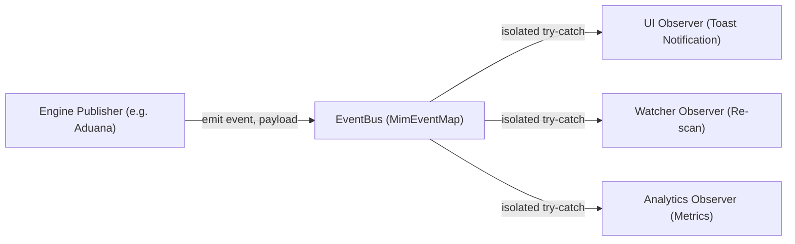

# ADR-001: Reactive Typed Event Bus for Cross-Engine Communication and Fault Isolation

- **Status:** Accepted
- **Deciders:** Systems Architecture Team
- **Date:** 2026-05-10 (Formalized 2026-09-03)

---

## 1. Context & Problem Statement

MIM orchestrates seven autonomous domain engines: Core, Modpack, SAGE, Security, Aduana, NBT Rescue, and FOMO Cloud Sync. 

In a desktop Electron application combining Next.js App Router API endpoints with long-running filesystem watchers and background tasks, direct coupling between services introduces critical failure modes:
1. **Circular Import Dependencies:** Next.js bundling and Turbopack throw compilation cycles when high-level UI controllers import low-level engine workers that in turn reference application state.
2. **Cascading Runtime Exceptions:** If an unhandled exception occurs in a secondary observer (e.g. updating a UI notification badge or writing an analytical log), direct method calls would abort the primary transactional operation (e.g. downloading a mod or writing a world file).
3. **Testing Rigidity:** Tight coupling prevents mocking individual engines in isolation during headless test runs.

---

## 2. Decision

We implement an **Asynchronous In-Memory Reactive Event Bus** (`lib/events/eventBus.ts`) governed by a strictly typed contract (`MimEventMap` in `lib/events/eventContract.ts`):

1. **Inversion of Control:** Engines publish domain events (e.g. `fomo:download-completed`, `sage:crash-detected`, `aduana:cache-invalidated`, `system:refresh`) without awareness of subscribing consumers.
2. **Isolated Execution Boundaries:** Event dispatchers execute listener callbacks inside independent `try/catch` wrappers. Observer failures are captured in diagnostic channels without terminating the publishing thread.
3. **Type-Safe Contract:** The payload schema of every event is statically enforced via TypeScript generics, eliminating untyped event strings.

---

## 3. Consequences

### Positive
- **Zero Circular Dependencies:** Engines communicate over contract interfaces; Turbopack builds compile cleanly with zero cycle warnings.
- **Robust Fault Isolation:** A failure in diagnostic logging or UI rendering cannot interrupt physical file synchronization or modpack builds.
- **Observability:** Centralized audit points allow correlation engines (`lib/intelligence/correlationEngine.ts`) to observe multi-event temporal patterns (e.g., download completed + immediate crash detection = inconsistent environment alert).

### Negative / Trade-offs
- **Indirection:** Code navigation requires inspecting event contracts rather than clicking directly into function definitions.
- **In-Memory Lifetime:** Event delivery is local to the active process. Cross-process communication with Electron main requires explicit IPC bridges (`window.electron.send`).
