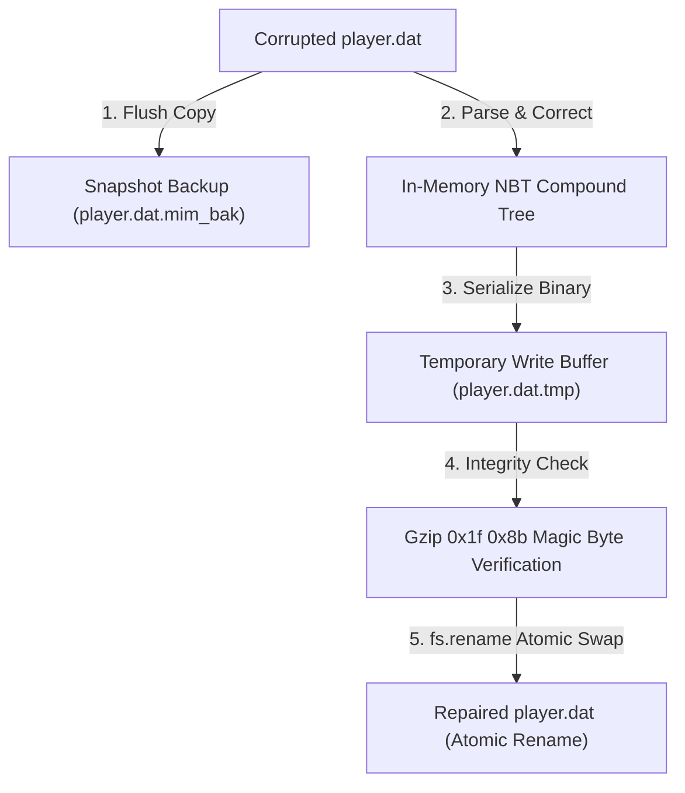

# ADR-004: Atomic Writes and Mandatory Snapshot Backups for Corrupted NBT Recovery

- **Status:** Accepted
- **Deciders:** Data Integrity & Systems Engineering Team
- **Date:** 2026-05-25 (Formalized 2026-09-03)

---

## 1. Context & Problem Statement

Minecraft singleplayer worlds and multiplayer servers store critical player data (`playerdata/<uuid>.dat`) and world state (`level.dat`) using Mojang's **Named Binary Tag (NBT v19133)** format compressed with RFC 1952 Gzip.

When players experience coordinate NaN errors, inventory corruption, or dimension deadlocks:
1. **Destructive Direct Edits:** Naive editors open the binary stream, modify bytes in-place, and overwrite the target file. If the OS crashes, power is lost, or the writer encounters an unhandled runtime error mid-stream, the file is truncated to 0 bytes, irreversibly destroying player inventory and hundreds of hours of progress.
2. **Type Coercion Corruption:** Minecraft's internal DFU (DataFixerUpper) expects strict primitive types. If floating-point coordinates (`Pos`) are serialized as Floats instead of Doubles, or dimension strings are malformed, Minecraft will discard the entire player state upon loading.

---

## 2. Decision

We establish the **Zero-Data-Loss Invariant**:
$$\text{INVARIANT}: \quad \text{Source binary state is NEVER overwritten without a verified, flushed backup.}$$

The NBT Rescue Engine implements a multi-step transactional atomic write protocol:
1. **Pre-Mutation Snapshot:** Prior to opening any write stream, the engine copies the target file to `<filename>.<timestamp>.mim_bak`.
2. **Strict Spec Type Enforcement:** The schema validator guarantees Mojang NBT v19133 type compliance:
   - `Pos`: strictly `TAG_List` of `TAG_Double` (8 bytes per coordinate).
   - `Rotation`: strictly `TAG_List` of `TAG_Float` (4 bytes per angle).
   - `SpawnX/Y/Z`: strictly `TAG_Int` (4 bytes).
3. **Isolated Temporary File Serialization:** The modified binary tree is serialized into a temporary sibling file (`<filename>.tmp`).
4. **Binary Validation Check:** The engine reads back the first 2 bytes of `.tmp` to confirm valid Gzip magic bytes (`0x1f 0x8b`) and decodes the root `TAG_Compound`.
5. **Atomic Rename Swap:** The temporary file is swapped over the target file using atomic filesystem operations (`fs.rename`), ensuring that an interruption at any point leaves the original file completely intact.

---

## 3. Consequences

### Positive
- **Zero-Data-Loss Invariant & Crash Consistency:** Incomplete writes or unexpected process termination cannot truncate or destroy original save files because modifications are written to a separate staging buffer (`.tmp`) and atomically swapped only after validation.
- **Rollback Safety:** If a player desires their prior corrupted state, the `.mim_bak` file provides an instant 1-click restore.
- **100% Type Compliance:** Verified by 12/12 integration tests covering inventory compounds, doubles, floats, and Nether dimension switches.

### Negative / Trade-offs
- **Disk Overhead:** Creating `.mim_bak` files consumes disk space proportional to player inventory size (typically 10 KB to 500 KB per backup). An automatic backup pruner (`/api/sage/player-rescue/purge-backups`) is provided to maintain storage hygiene.
