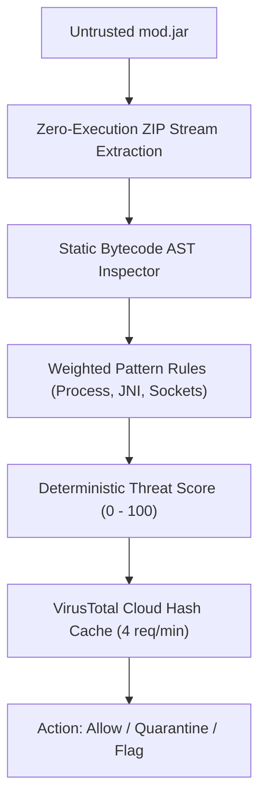

# ADR-005: Static Bytecode Inspection Instead of Executing Unknown JARs

- **Status:** Accepted
- **Deciders:** Application Security & Systems Architecture Team
- **Date:** 2026-05-28 (Formalized 2026-09-03)

---

## 1. Context & Problem Statement

Minecraft mods are packaged as Java JAR archives (ZIP files containing compiled `.class` bytecode). In the 2023 *Fractureiser* supply-chain outbreak, hundreds of popular mods hosted on CurseForge and Modrinth were compromised with malicious stage-1 droppers.

To protect developers and players, we evaluated two architectural security models:
1. **Dynamic Sandbox Execution (Dynamic Analysis):** Spin up headless JVM child processes with a Java SecurityManager or isolated container to observe runtime system calls.
2. **Static Bytecode AST Inspection (Static Analysis):** Parse the compiled `.class` files inside the JAR directly from disk without ever executing Java code or loading classes into the active classloader.

---

## 2. Decision

We chose **Static Bytecode AST Inspection** (`lib/security/jarScanner.ts`):

1. **Zero-Execution Principle:** Untrusted JAR archives are never passed to `java.exe`, `ClassLoader.loadClass()`, or unmanaged native runtimes. Scanning a malware-infected mod cannot execute its dropper payload.
2. **Decompression & Pattern Tokenization:** The engine reads ZIP entry byte streams, isolates `.class` headers, and scans string constants and bytecode opcodes for high-severity malicious indicators:
   - **Process Execution:** `Runtime.getRuntime().exec()`, `ProcessBuilder` (+25 pts).
   - **Shell Invocations:** `powershell.exe`, `cmd.exe`, `bash`, `curl -O`, `certutil` (+20 pts).
   - **Native Unmanaged Code:** `System.loadLibrary()`, JNI C-bindings (+20 pts).
   - **Dynamic Reflection Evasion:** `setAccessible(true)`, dynamic `defineClass()` (+15 pts).
   - **Exfiltration Network Sockets:** Unauthorized raw TCP `Socket` connections (+10 pts).
3. **Composite Scoring & Thresholds:** Emits a deterministic Threat Score (0–100) mapped to STRIDE severity levels (Clean, Caution, Suspicious, Critical).
4. **Cloud Enrichment as Second Opinion:** Hashes are queried against the VirusTotal multi-engine API through an in-memory rate-limiting cache (4 req/min ceiling) to avoid quota starvation.

---

## 3. Consequences

### Positive
- **Host Immunity:** Zero risk of malware detonation during the scanning phase.
- **Ultra-Fast Throughput:** Bounded concurrency (5 files/batch) scans hundreds of mods in seconds without spinning up heavy JVM instances.
- **Explainable Lineage:** Emits an exact audit trail linking every flag to the offending class file and opcode pattern.

### Negative / Trade-offs
- **Obfuscation Limits:** Heavily encrypted reflection payloads using custom XOR/AES string encryption may bypass static string matching without flagging secondary indicators.
- **Benign Edge Cases:** Advanced developer utility mods that legitimately execute external processes (e.g. launching a web browser or profiler) must be whitelisted against known signatures.
