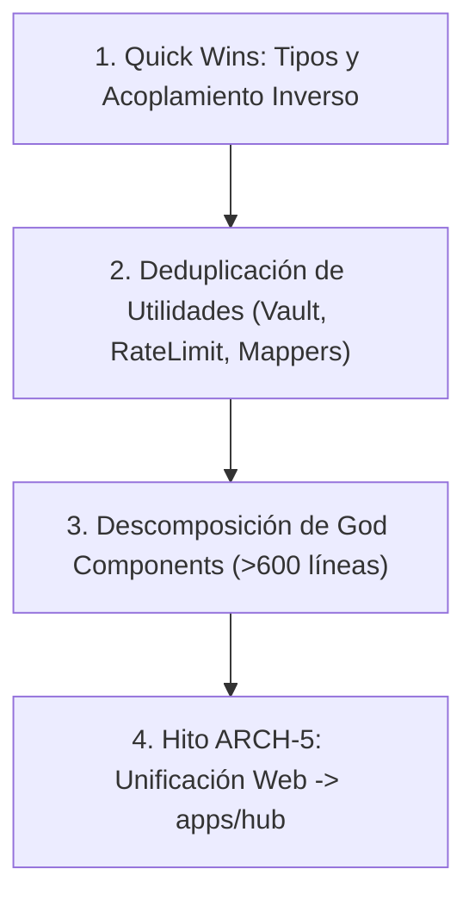

# Auditoría Integral de Refactorización y Deuda Técnica (MIM Monorepo)

**Fecha**: 9 de Septiembre de 2026  
**Alcance**: Todo el repositorio (`apps/`, `packages/`, `components/`, `lib/`, `web/`, `app/`, `scripts/`)  
**Objetivo**: Identificar componentes sobredimensionados (> 600 líneas), código duplicado o bifurcado entre surfaces, ciclos de importación y oportunidades de modularización y reutilización.

---

## 1. Resumen Ejecutivo y Métricas de Código

| Métrica | Valor Actual | Umbral Deseado | Estado |
|---|---|---|---|
| **Archivos que violan límite modular (> 600 líneas funcionales)** | **9 archivos** | 0 archivos | 🔴 Requiere Descomposición |
| **Archivos en zona de riesgo (450 a 600 líneas funcionales)** | **17 archivos** | Monitoreo | 🟡 Atención Preventiva |
| **Archivos duplicados / bifurcados (`web/` vs `root`)** | **14 módulos clave** | 0 (Shared Packages) | 🟠 Sincronizar en ARCH-5 |
| **Ciclos de dependencia en grafo interno** | **4 ciclos** | 0 ciclos | 🟡 Romper dependencias |
| **Anomalías de acoplamiento inverso (Engine importa UI)** | **2 archivos** | 0 violaciones | 🟡 Extraer contratos |

---

## 2. Archivos que Superan el Límite de Modularidad (> 600 Líneas)

> **Regla de Arquitectura**: Ningún componente o módulo debe superar las **600 líneas de código funcional** (sin contar comentarios ni bloques JSDoc).

```
┌──────────────────────────────────────────────┬──────────────────┬───────────────┬──────────────────────────────────────────┐
│ Archivo                                      │ Líneas Func.     │ Total Líneas  │ Dominio / Surface                        │
├──────────────────────────────────────────────┼──────────────────┼───────────────┼──────────────────────────────────────────┤
│ web/hooks/useHomeController.ts               │ 957 func.        │ 1057 tot.     │ Web / Hub Orchestration Hook             │
│ web/components/tabs/DiscoverTab.tsx          │ 860 func.        │ 921 tot.      │ Web / Feed & Discover UI                 │
│ components/fomo/core/FomoVersionOverlay.tsx  │ 839 func.        │ 925 tot.      │ Desktop / Version Modal & Downloader     │
│ web/components/DraftDetailView.tsx           │ 812 func.        │ 865 tot.      │ Web / Modpack Draft Inspector            │
│ components/fomo/sidebar/FomoSidebarDiscover. │ 744 func.        │ 782 tot.      │ Desktop / Navigation Sidebar Branch      │
│ components/fomo/showcase/FomoYoutubeShowcase │ 711 func.        │ 834 tot.      │ Desktop / Video Player & Cards           │
│ web/components/MobileFloatingPlayer.tsx      │ 701 func.        │ 796 tot.      │ Web / Floating Video Player & Gestures   │
│ components/fomo/followed/FomoFollowedShowcas │ 688 func.        │ 746 tot.      │ Desktop / Followed Creator Feed          │
│ web/components/SpotlightMarquees.tsx         │ 662 func.        │ 724 tot.      │ Web / Animated Marquee Grids             │
└──────────────────────────────────────────────┴──────────────────┴───────────────┴──────────────────────────────────────────┘
```

### Propuestas de Descomposición Modular

#### A. `web/hooks/useHomeController.ts` (957 líneas)
- **Problema**: Actúa como un *God Hook* que centraliza estado de filtros, paginación, modales, reproducción de video, drafts de modpack y URLs de consulta en una sola función gigante.
- **Propuesta de Refactorización**:
  1. `useHomeFilters.ts`: Gestión de búsqueda, etiquetas, categorías y loaders.
  2. `useHomePlayer.ts`: Estado del reproductor flotante y control de reproducción.
  3. `useHomeDraftSync.ts`: Sincronización del draft activo con LocalStorage / Vault.
  4. `useHomeController.ts`: Reducir a un compositor delgado (< 150 líneas) que combine los sub-hooks.

#### B. `web/components/tabs/DiscoverTab.tsx` (860 líneas)
- **Problema**: Renderiza simultáneamente la barra de búsqueda rápida, badges de categorías, carrusel de destacados, selector de orden y lista virtualizada de tarjetas.
- **Propuesta de Refactorización**:
  1. `components/tabs/discover/DiscoverSearchBar.tsx`: Input, filtros de orden y debounce.
  2. `components/tabs/discover/DiscoverCategoryPills.tsx`: Badges de modloader y categoría.
  3. `components/tabs/discover/DiscoverFeaturedGrid.tsx`: Grid de proyectos promocionados.
  4. `DiscoverTab.tsx`: Contenedor orquestador (< 200 líneas).

#### C. `components/fomo/core/FomoVersionOverlay.tsx` (839 líneas)
- **Problema**: Mezcla la lógica de resolución de dependencias CurseForge/Modrinth, cálculo de hashes SHA-1/SHA-512, estado del selector de versión y animaciones de descarga.
- **Propuesta de Refactorización**:
  1. `components/fomo/core/version-overlay/VersionList.tsx`: Tabla de versiones y filtrado por modloader.
  2. `components/fomo/core/version-overlay/VersionDependencies.tsx`: Lista de dependencias requeridas e incompatibilidades.
  3. `components/fomo/core/version-overlay/VersionDownloadAction.tsx`: Botón de acción con barra de progreso y estado.

#### D. `web/components/DraftDetailView.tsx` (812 líneas)
- **Problema**: Contiene visualización de items, exportación a `.zip`, cálculo de dependencias de modpack, estadísticas y edición de título/descripción.
- **Propuesta de Refactorización**:
  1. `components/draft/DraftHeader.tsx`: Título editable, badge de loader/versión y acciones de exportación.
  2. `components/draft/DraftStatsPanel.tsx`: Resumen de tamaño, número de mods y compatibilidad.
  3. `components/draft/DraftModList.tsx`: Grid/lista con eliminación e inspección individual.

#### E. `web/components/MobileFloatingPlayer.tsx` (701 líneas) vs `FomoFloatingPlayer.tsx` (535 líneas)
- **Problema**: Existe una duplicación masiva de lógica entre el reproductor de YouTube de Web y el de Desktop, incluyendo manejo de gestos táctiles y minimización.
- **Propuesta de Refactorización**:
  - Extraer el hook `useFloatingPlayerGestures.ts` para compartir cálculo de arrastre (drag physics) y controles de reproducción.

---

## 3. Archivos en Zona de Riesgo (450 a 600 Líneas)

Estos componentes funcionan correctamente pero se encuentran cerca del límite modular y deben vigilarse para evitar su degradación:

1. `components/layout/SettingsComponents.tsx` (598 líneas) ➔ Separar pestañas de configuración (General, JVM, SFTP, Apariencia).
2. `components/fomo/community/draft-tabs/DraftItemsTab.tsx` (588 líneas) ➔ Extraer subcomponentes de tarjeta de mod.
3. `components/layout/TweakSidebar.tsx` (582 líneas) ➔ Extraer paneles de perfiles y modpacks.
4. `components/fomo/community/CommunityDraftDetails.tsx` (576 líneas) ➔ Modularizar comentarios y likes.
5. `web/app/api/fomo/youtube-posts/route.ts` (560 líneas) ➔ Extraer scraper / parser de YouTube a `lib/fomo/youtubeParser.ts`.
6. `components/fomo/showcase/FomoFloatingPlayer.tsx` (535 líneas) ➔ Extraer controles UI y hook de arrastre.
7. `app/api/tweak/route.ts` (523 líneas) ➔ Descomponer handlers de sub-acciones de modding.
8. `components/fomo/sidebar/FomoSidebar.tsx` (499 líneas) ➔ Subdividir ramas de navegación.
9. `components/fomo/followed/FomoFollowedAuthors.tsx` (495 líneas) ➔ Extraer tarjetas de creadores.
10. `components/tweak/parts/PackHierarchyManager.tsx` (491 líneas) ➔ Modularizar árbol de dependencias.
11. `components/fomo/spotlight/SpotlightShowcaseRow.tsx` (490 líneas) ➔ Extraer tarjetas de video.
12. `components/sage/parts/SageMimbotCopilot.tsx` (479 líneas) ➔ Modularizar entrada de chat, lista de mensajes y selector de modelo BYOK.

---

## 4. Oportunidades de Deduplicación y Consolidación (`web/` vs `root`)

Durante el análisis del grafo se detectaron múltiples módulos con lógica paralela o forkeada entre `web/` y la raíz del proyecto. Estos son los candidatos prioritarios para ser unificados en `packages/*` antes o durante **`ARCH-5`**:

| Módulo en `root` | Módulo en `web/` | Diagnóstico | Acción Recomendada |
|---|---|---|---|
| `types/fomo.ts` (192 l.) | `web/types/fomo.ts` (192 l.) | **100% Idénticos** | Mover a `@mim/contracts-core/fomo` |
| `lib/vault/vaultEngine.ts` (289 l.) | `web/lib/vault/vaultEngine.ts` (292 l.) | Fork leve con schema V1 | Unificar en `@mim/vault-engine` |
| `lib/rateLimiter.ts` (72 l.) | `web/lib/rateLimiter.ts` (73 l.) | Mismo algoritmo token-bucket | Unificar en `@mim/network-resilience` |
| `lib/intelligence/modExplainer.ts` (433 l.) | `web/lib/intelligence/modExplainer.ts` (428 l.) | Prompts y lógica gemelos | Extraer a `@mim/intelligence-core` |
| `components/fomo/spotlight/SpotlightMarquees.tsx` | `web/components/SpotlightMarquees.tsx` | Versión desktop vs web con estilos divergentes | Extraer hook común de marquee (`useSmoothMarquee`) |
| `services/curseforge/CurseForgeMapper.ts` | `web/app/api/curseforge/discover/CurseForgeMapper.ts` | Mapeo de categorías y loaders duplicado | Extraer a package `@mim/mod-mappers` |
| `app/api/bedrock/discover/route.ts` | `web/app/api/bedrock/discover/route.ts` | Endpoint de catálogo Bedrock duplicado | Compartir handler puro |

---

## 5. Ciclos de Dependencias y Acoplamientos Inversos

### Ciclos Detectados en el Grafo

1. **`lib/scanner.ts` ⇄ `lib/scanner/parsers.ts` / `lib/scanner/scoring.ts`**:
   - `scanner.ts` importa tipos y parsers de subcarpetas, y `parsers.ts` re-importa interfaces de `scanner.ts`.
   - **Solución**: Crear `lib/scanner/types.ts` puro para que tanto el scanner principal como los submódulos dependan sólo de los tipos sin ciclos.

2. **`lib/intelligence/incidentManager.ts` ⇄ `lib/intelligence/incidentStorage.ts` ⇄ `lib/storage/storage-fallback.ts`**:
   - El gestor de incidentes y su almacén se llaman mutuamente para invalidación de caché.
   - **Solución**: Invertir la dependencia pasando un callback o emitter de eventos.

### Acoplamiento Inverso (Engine dependiente de UI)

1. `lib/fomo/fomoDiscoverActions.ts` ➔ `components/fomo/sidebar/fomoSidebarTypes.ts`
2. `lib/fomo/fomoDiscoverPending.ts` ➔ `components/fomo/sidebar/fomoSidebarTypes.ts`
   - **Problema**: Lógica de infraestructura/engine de `lib/fomo/` está importando tipos definidos dentro de `components/`.
   - **Solución**: Mover las definiciones de `fomoSidebarTypes.ts` a `types/fomo.ts` o `@mim/contracts-core`.

---

## 6. Plan de Acción Recomendado



1. **Fase 1: Quick Wins (Bajo Riesgo)**:
   - Mover `fomoSidebarTypes.ts` a contratos/tipos puros para eliminar el acoplamiento de `lib/` hacia `components/`.
   - Romper el ciclo de `lib/scanner/` extrayendo `lib/scanner/types.ts`.

2. **Fase 2: Unificación de Motores Duplicados**:
   - Consolidar `vaultEngine.ts`, `rateLimiter.ts` y `modExplainer.ts` para que `web/` consuma directamente desde packages puros sin duplicar código.

3. **Fase 3: Descomposición de God Components**:
   - Descomponer `useHomeController.ts` (957 l.) y `DiscoverTab.tsx` (860 l.) en sub-hooks y subcomponentes modulares (< 300 líneas c/u).
   - Descomponer `FomoVersionOverlay.tsx` (839 l.) y `DraftDetailView.tsx` (812 l.).
