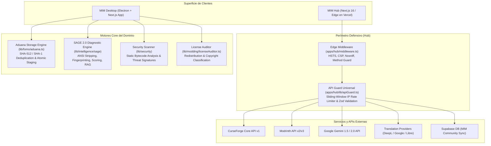
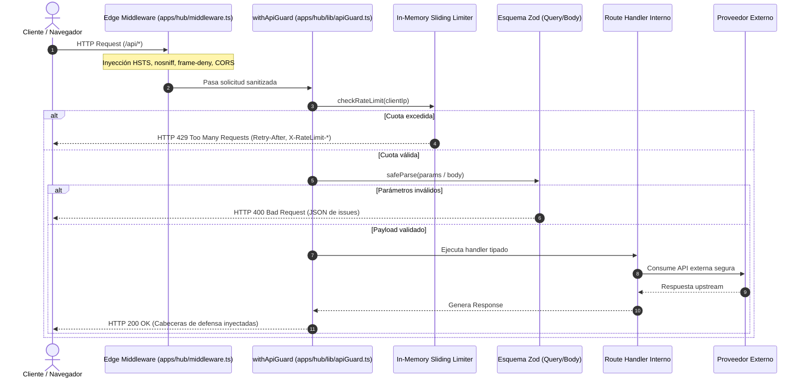
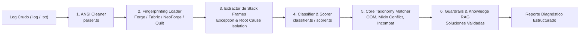
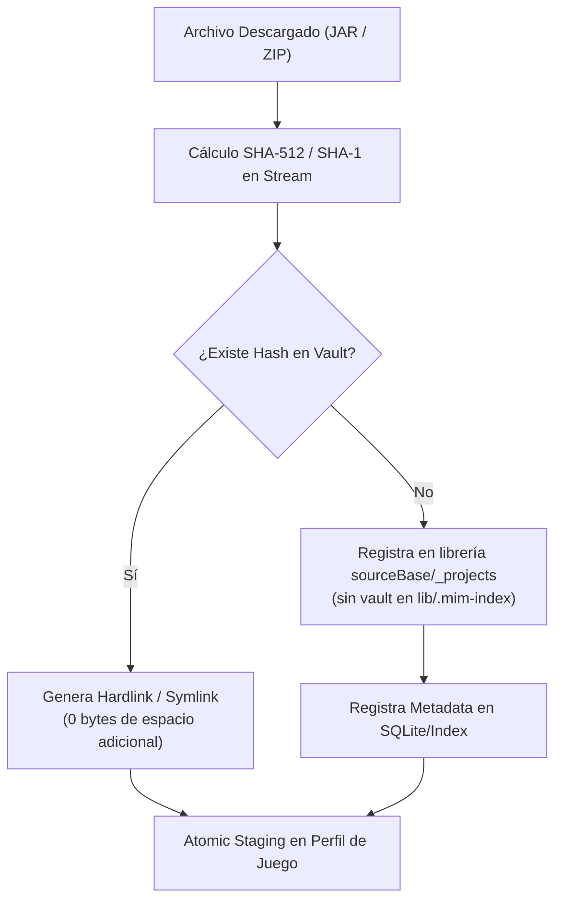

# MIM System Architecture & Engineering Blueprint

Este documento describe la topología, arquitectura de software, ciclo de vida de datos y contratos de integración de **MIM (Minecraft Intelligent Manager)**. Su objetivo es brindar una referencia técnica completa que garantice la mantenibilidad, escalabilidad y la mitigación del *bus factor* para cualquier desarrollador o auditor externo.

---

## 1. Topología del Sistema y Ecosistema

MIM opera como una plataforma híbrida compuesta por dos clientes y un backend perimetral:

---

## 2. Arquitectura Defensiva de API (Defense-in-Depth)

Todas las rutas públicas de MIM Hub (`apps/hub/app/api/*`) implementan un modelo de seguridad por capas en profundidad:

### Componentes Clave:
- **`apps/hub/middleware.ts`**: Aplica filtrado de métodos HTTP autorizados (`GET`, `POST`, `OPTIONS`, `HEAD`), preflight de CORS y encabezados de protección universal (`Strict-Transport-Security`, `X-Content-Type-Options: nosniff`, `X-Frame-Options: DENY`, `Referrer-Policy: strict-origin-when-cross-origin`).
- **`apps/hub/lib/apiGuard.ts`**: Higher-Order Function `withApiGuard` que encapsula:
  - Extracción robusta de IP considerando proxies (`x-forwarded-for`, `x-real-ip`, `cf-connecting-ip`).
  - Rate limiting en memoria con ventana deslizante (default: 60 req/min para búsquedas, 20 req/min para IA y traducción).
  - Validación y coercitividad tipada con esquemas Zod tanto para Query (`querySchema`) como para Body (`bodySchema`).
  - Captura y manejo seguro de excepciones sin fuga de stack traces internos.

---

## 3. Pipeline de Diagnóstico SAGE 2.0

SAGE (**S**ystemic **A**utomated **G**uidance & **E**valuation) procesa logs de errores y crash dumps de Minecraft. Glosario de nombres: [nomenclatura.md](../guides/nomenclatura.md).

---

## 4. Motor de Almacenamiento y Deduplicación Aduana

Aduana gestiona el almacenamiento masivo de mods, modpacks, shaders y resourcepacks con cero duplicación física en disco:

---

## 5. Motor de Amenazas y Seguridad (Security Scanner)

El pipeline de análisis de seguridad de archivos JAR de terceros opera en 4 fases:

1. **Chequeo de Hash Inmediato**: Comparación contra la base de datos de 19 firmas de amenazas conocidas de alto impacto (Fracturiser, Necro RAT, etc.).
2. **Caché y Consulta VirusTotal**: Conexión con VT API v3 con caché local persistente en `mimIndexPath/cache/vt-cache.json` (ver [mim-index.md](./mim-index.md)).
3. **Análisis Estático de Bytecode**: Inspección profunda de archivos `.class` dentro del archivo ZIP/JAR buscando invocaciones reflectivas sospechosas (`Runtime.getRuntime().exec`, `ProcessBuilder`, sockets de red ocultos, payloads ofuscados).
4. **Auditoría de Licencias y Redistribución**: Clasificación automática del archivo (`PERMISSIVE`, `COPYLEFT`, `RESTRICTED`, `UNKNOWN`) advirtiendo sobre cláusulas restrictivas o "All Rights Reserved" antes de empaquetar modpacks.

---

## 6. Convenciones de Código y Estándares del Proyecto

- **Sin Carpeta `src`**: El código vive en `app/`, `apps/` (desktop + hub), `packages/`, `lib/`, `components/`, `hooks/`, `services/`.
- **Límite de Modularidad**: Ningún componente debe superar **600 líneas de código funcional** (sin contar comentarios ni interfaces de documentación).
- **Testing Headless**: `npm test` ejecuta el catálogo en `scripts/test-suites.js` (~36 suites).
- **Verificación Visual**: Reservada exclusivamente para el desarrollador humano (sin subagentes de navegador ni capturas de pantalla invasivas).
