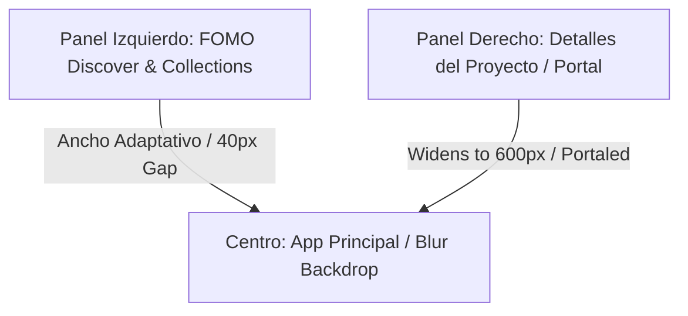

# 👁️ FOMO (Find Out More, Obviously) — Descubrimiento y Gestión de Mods en Tiempo Real

**FOMO** es el módulo inteligente de descubrimiento de contenido integrado de **MIM (Minecraft Intelligent Manager)**. Su nombre proviene de la ingeniosa frase en inglés *"Find Out More, Obviously"* (Entérate de más, obviamente), y está diseñado precisamente para que el usuario pueda explorar, descubrir y profundizar en los mejores y más recientes mods, texturas, shaders y data packs de la comunidad de Minecraft sin fricciones.

La filosofía detrás de FOMO es **redefinir el flujo de trabajo del jugador/creador de modpacks**: en lugar de tener que abrir un navegador web, descargar archivos manualmente a la carpeta de descargas, y luego moverlos, FOMO integra todo el motor de búsqueda de **Modrinth** y **CurseForge** directamente dentro del gestor, ofreciendo una experiencia interactiva sin costuras.

---

## 🌟 Características Principales

### 1. Búsqueda Multi-Fuente Unificada
FOMO permite alternar con un solo clic entre las dos plataformas más grandes de alojamiento de Minecraft:
*   **Modrinth**: Una API limpia y moderna que ofrece respuestas veloces.
*   **CurseForge**: Compatibilidad masiva de proyectos históricos (requiere configuración de clave de API en `.env.local`).

### 2. Filtros Dinámicos Inteligentes
La barra lateral flotante de filtros de FOMO proporciona un control granular absoluto sobre las consultas:
*   **Categoría de Proyecto**: Filtrado instantáneo entre **Mods**, **Texturas** (Resource Packs), **Shaders** y **Data Packs**.
*   **Mod Loader**: Filtrado específico para Forge, Fabric, NeoForge o Quilt.
*   **Versión del Juego**: Selección múltiple de versiones de Minecraft (desde las más recientes como 1.21.1, hasta históricas).
*   **Entornos de Compatibilidad**: Clasificación de proyectos que requieren ejecución del lado del cliente, del servidor o ambos.
*   **Categorías Temáticas**: Filtro por tags especializados (Aventura, Optimización, Almacenamiento, etc.).

### 3. Ordenamiento Integrado y Eficiente
Consolidado de forma inteligente en la barra de filtros del panel lateral para limpiar la cabecera y ganar espacio vertical de contenido:
*   **Relevancia**: Los proyectos con mejor correlación a la búsqueda actual.
*   **Descargas**: Los proyectos más populares e instalados de la comunidad.
*   **Recientes**: Las últimas actualizaciones y novedades publicadas.

---

## ⚡ La Experiencia "Floating Glass Gutter" (Multitarea Tridimensional v3.0 - COMPLETADO)

FOMO introduce un diseño de interfaz de usuario multi-capa tridimensional, asincrónico y fluido:

### Flujo de Trabajo y Sincronización del Layout
Cuando el usuario interactúa con **FOMO** y los detalles de un proyecto:

1.  **Apertura del Descubrimiento**: El panel de descubrimiento se despliega desde el extremo izquierdo de la pantalla, empujando la interfaz principal de MIM hacia la derecha con una transición fluida y aplicando un elegante efecto de desenfoque (`blur`).
2.  **Soporte de Detalles Portaleado**: Cuando el usuario hace clic en **Detalles** de un mod, la vista se traslada usando un **React Portal** al contenedor lateral derecho `#fomo-details-sidebar-portal`, dejando visible todo el panel izquierdo de FOMO.
3.  **Contracción de Ancho Inteligente**: Para evitar solapamientos y mantener una visualización limpia:
    *   La barra lateral derecha se expande de `380px` a **`600px`** (`max-w-[90vw]`) para proveer un espacio de lectura premium de changelogs y versiones.
    *   El panel lateral de FOMO se contrae dinámicamente de su ancho normal (`75vw`) a exactamente **`calc(100vw - 600px - 40px)`**.
4.  **Efecto Glass Gutter**: Esta contracción deja una franja vertical vacía de **`40px`** entre FOMO y Detalles que expone el fondo desenfocado de la aplicación principal. FOMO conserva sus esquinas redondeadas derechas (`0 2rem 2rem 0`), creando una espectacular ilusión de dos paneles de vidrio flotando side-by-side sobre el espacio de trabajo.
5.  **Grilla Dinámica de Columnas Forzada**: 
    *   **Detalles Cerrados**: El feed de mods se visualiza en una grilla responsiva de hasta **3 columnas** (`grid-cols-1 lg:grid-cols-2 xl:grid-cols-3`).
    *   **Detalles Abiertos**: Al abrirse los detalles, para evitar que las tarjetas colapsen por la reducción del espacio, el sistema fuerza la grilla a exactamente **2 columnas** tanto en la pestaña de Descubrir como en la pestaña de Mis Colecciones.

---

## 👆 Selección de Mods en Bloque y Descarga Masiva

El sistema de selección de mods ha sido perfeccionado para ofrecer fricción cero:

1.  **Click de Selección Libre**: Puedes seleccionar/deseleccionar un mod haciendo click en **cualquier parte de la tarjeta**, no solo en el indicador circular de check.
2.  **Protección de Botones de Acción (e.stopPropagation)**: Si haces click en los botones de acción específica de una tarjeta (*Detalles*, *Descargar*, *Web* o *Colección*), el evento no se propaga a la tarjeta. Esto permite realizar la acción de inmediato sin conmutar accidentalmente el estado de selección del mod.
3.  **Selección Unificada en Colecciones**: Esta lógica de selección ultra-precisa y visualización en grilla se encuentra integrada tanto en la pestaña de **Descubrir** como en la vista interna de **Mis Colecciones**.
4.  **Barra de Acciones Masivas (Bulk Download Bar)**: Al seleccionar uno o más mods en cualquiera de las pestañas, se eleva suavemente una barra inferior con el recuento de elementos que permite descargar todo el lote en bloque con un solo click.

---

## 📦 Sincronización de Colecciones y Selector de Versiones

FOMO 3.0 cierra el ciclo de gestión con dos herramientas críticas:
*   **Sincronización de Colecciones**: Integración total con Modrinth para importar tus colecciones personales y las que sigues, permitiendo bajarlas al instante.
*   **Selector Manual**: Control total para elegir versiones específicas de Datapacks, Shaders y Resourcepacks antes de la descarga.

---

## 🛠️ Arquitectura y Componentes Técnicos

El sistema de FOMO está diseñado de manera modular y altamente optimizada para prevenir el acoplamiento de código:

### 📁 Estructura de Archivos Scoped
*   [fomo.css](file:///d:/Dev/CodeProjects/MIM/components/fomo/fomo.css): Concentra el 100% de las variables y estilos visuales de FOMO, separando por completo la carga visual del archivo global de la aplicación (`globals.css`).
*   [FomoSidebar.tsx](file:///d:/Dev/CodeProjects/MIM/components/fomo/FomoSidebar.tsx): El cascarón del panel lateral que gestiona las pestañas de **Descubrir** y **Colecciones**. Calcula el ancho dinámico de la vista de descubrimiento y despacha eventos de toggle de detalles.
*   [FomoCollections.tsx](file:///d:/Dev/CodeProjects/MIM/components/fomo/FomoCollections.tsx): Componente que renderiza colecciones locales y remotas. Soporta la grilla responsiva de columnas dinámicas, el listado de tarjetas seleccionables y su propia barra de descargas masivas en lote.
*   [FomoDiscoverFilters.tsx](file:///d:/Dev/CodeProjects/MIM/components/fomo/FomoDiscoverFilters.tsx): El panel flotante e independiente con bordes curvos y fondo translúcido que ola la barra de selectores de búsqueda y las opciones de ordenamiento.
*   [FomoVersionOverlay.tsx](file:///d:/Dev/CodeProjects/MIM/components/fomo/FomoVersionOverlay.tsx): Modal de detalles del proyecto. Cuenta con un sistema flexible libre de colisiones visuales (`flex-wrap`) para presentar metadatos complejos (Entornos, Plataformas y Versiones compatibles) sin importar el ancho del contenedor.
*   [useFomoDiscover.ts](file:///d:/Dev/CodeProjects/MIM/hooks/useFomoDiscover.ts): Hook de React que concentra las llamadas a la API, gestión de paginación y estado del buscador.

### 🔄 Resolución de Race Conditions en Portales (DOM Polling Finder)
Para resolver la falta de sincronización típica cuando componentes hermanos intentan portalarse simultáneamente antes de que el nodo de destino (`#fomo-details-sidebar-portal`) se termine de renderizar en el DOM, `FomoVersionOverlay` utiliza un gancho de reintento inteligente:
*   Realiza una búsqueda inicial inmediata del contenedor.
*   Si no lo encuentra, inicia un sondeo ultra-rápido de reintentos cada **`20ms`** por un máximo de **10 veces (200ms)**.
*   Esto asegura una captura del portal segura y veloz en cuanto el cuerpo de la aplicación termina de procesar el renderizado del sidebar.

### 🌐 Sincronización de Eventos de Ventana
Dado que el estado de apertura de FOMO reside en el Layout principal, el sistema propaga los cambios utilizando eventos de ventana personalizados:
*   `fomo-toggle`: Conmuta la apertura del buscador general.
*   `fomo-details-toggle`: Comunica la apertura o cierre del panel de detalles del proyecto para redimensionar el sidebar de descargas.

Esto permite que otros componentes del sistema (como el grid principal en `page.tsx`) escuchen y reaccionen de inmediato de manera reactiva, desplazando elementos o activando la barra de descargas portaleada.
