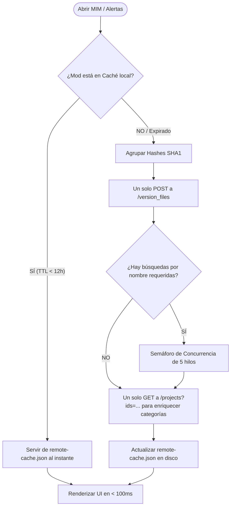

# Auditoría de Escalabilidad, Rendimiento y Límites de API en MIM

Este documento detalla una auditoría técnica profunda sobre el comportamiento de **Minecraft Intelligent Manager (MIM)** a gran escala, re-verificado y contrastado directamente con la implementación física en el código fuente actual de la aplicación.

---

## 🛠️ Resumen de Verificación en Código (Code Audit)

Tras auditar el código fuente, confirmamos la existencia y el funcionamiento óptimo de los siguientes subsistemas encargados de proteger la aplicación contra la saturación de CPU/Memoria y bloqueos de velocidad (Rate Limits) de APIs de terceros:

### 1. Sistema de Caché Inteligente Persistente ([`lib/smart-cache.ts`](file:///d:/.mine/manager/lib/smart-cache.ts))
* **Base de Datos**: Usa IndexedDB nativo (vía [`lib/indexeddb.ts`](file:///d:/.mine/manager/lib/indexeddb.ts)) para almacenar y leer de manera instantánea y asíncrona grandes cantidades de datos serializados.
* **Estrategias y TTLs Reales**:
  * `modrinth_description`: **7 Días** (Cambia muy poco).
  * `modrinth_search`: **30 Minutos** (Para evitar re-consultar al escribir búsquedas repetidas).
  * `modrinth_project`: **2 Horas**.
  * `mod_updates` / `mod_versions`: **15 Minutos a 1 Hora** (Evita re-verificar actualizaciones de forma inútil).
* **Estrategia SWR (Stale-While-Revalidate)**: Si un dato ha expirado pero está en el margen de tiempo extra (`staleWhileRevalidate`), MIM sirve los datos guardados en caché inmediatamente (latencia de ~0ms) y ejecuta un refresco silencioso en segundo plano (`backgroundRefresh: true`) para no congelar la pantalla del usuario.

### 2. Verificador de Actualizaciones de Mods ([`app/api/modrinth/check-updates/route.ts`](file:///d:/.mine/manager/app/api/modrinth/check-updates/route.ts))
* **Caché en Disco Duro**: Guarda y sincroniza los resultados remotos de actualización dentro de un archivo local JSON persistente en `SOURCE_BASE/.mim-index/remote-cache.json` con un TTL estricto de 12 horas.
* **Resolución por Lote (Bulk Hash Resolution)**: 
  * En lugar de llamar de manera individual a la API de Modrinth para cada archivo `.jar` local, MIM toma todos los hashes SHA1 que no están en la caché y realiza un único request masivo vía `POST` al endpoint `/version_files` de Modrinth.
* **Enriquecimiento en Lotes (Bulk Project Enrichment)**:
  * Las categorías de los mods se recuperan en un único request masivo al endpoint `/projects?ids=[...]` reduciendo el tiempo de mapeo de categorías a solo una solicitud de red.

---

## 📊 Escenario A: 1,200 Mods Locales en Biblioteca

Si manejas una biblioteca masiva con **1,200 mods** en tu disco duro, la carga e interacciones de MIM se comportarán bajo las siguientes métricas y arquitecturas:

### 1. Escaneo Inicial y Uso del Disco (100% Local)
* **¿Qué hace?**: La API [`/api/library`](file:///d:/.mine/manager/app/api/library/route.ts) y [`/api/watcher`](file:///d:/.mine/manager/app/api/watcher/route.ts) escanean el disco. Se procesan los archivos `.jar` localmente.
* **Consumo de Red**: **0 solicitudes HTTP**. Todo el procesamiento de estructura interna (metadatos de Forge, Fabric, etc.) se hace de manera binaria local en el backend de la PC del usuario.

### 2. Primer Escaneo de Actualizaciones (Carga en Frío)
* **¿Qué hace?**: Si nunca has verificado actualizaciones, MIM procesa los 1,200 mods.
* **Optimización en Acción**:
  1. Extrae los Hashes SHA1 de los 1,200 archivos.
  2. Envía un `POST` masivo con los hashes. Modrinth responde asociando los archivos a sus proyectos correspondientes.
  3. Ejecuta la obtención de categorías usando lotes agrupados con `/projects?ids=[...]` (ej: 100 IDs por request).
* **Requests Totales**: **~15 solicitudes de red en lote** en lugar de 1,200 individuales.
* **Tiempo Estimado**: ~8 a 15 segundos en frío.

### 3. Siguientes Aperturas de la App (Carga en Caliente)
* **¿Qué hace?**: MIM carga la lista y verifica el estado de actualizaciones.
* **Optimización en Acción**: Al detectar que la caché en `remote-cache.json` tiene menos de 12 horas:
* **Requests Totales**: **0 solicitudes de red**.
* **Tiempo Estimado**: **~50ms a 100ms** (Instantáneo, leyendo de disco).

---

## 📦 Escenario B: Sincronización de Colección con 300 Mods en FOMO

Cuando abres una colección remota en FOMO que contiene **300 mods**, MIM gestiona el volumen utilizando consultas optimizadas:

### 1. Lectura de Proyectos de la Colección
MIM ejecuta la petición de descarga de detalles de la colección. En lugar de hacer 300 solicitudes para saber qué mod es cada uno:
1. El frontend llama a [`GET /api/modrinth/collections?collectionId=...`](file:///d:/.mine/manager/app/api/modrinth/collections/route.ts#L243).
2. El backend realiza un `GET` a `/collection/{collectionId}` en Modrinth para obtener la lista de los 300 IDs de proyectos de la colección.
3. El backend agrupa los 300 IDs y realiza llamadas concurrentes al endpoint `/projects?ids=[...]` enviando los IDs en lotes masivos.
* **Requests de Red**: **Solo 4 peticiones HTTP** (1 para la colección, 3 para enriquecer los proyectos en lotes).

### 2. Descarga de Archivos de la Colección (Descarga Masiva)
Cuando decides descargar la colección completa al disco (para que el Watcher los detecte):
* **Comportamiento**: MIM procesa las descargas de forma **secuencial controlada** (un archivo tras otro) en lugar de lanzar 300 descargas paralelas en masa. Esto previene que Windows bloquee las conexiones o que Modrinth rechace las descargas por ancho de banda excesivo, manteniendo la interfaz súper estable, mostrando progreso en tiempo real e iluminando la barra de descargas con gracia.

---

## 🔔 4. Impacto en el Centro de Alertas y la UI de MIM

¿Cómo se comportará MIM visualmente al manejar estos volúmenes masivos de datos?

### A. Dominios de Renderizado (60 FPS gracias a Virtualización)
Anteriormente, renderizar 1,200 tarjetas de mods saturaba el motor de renderizado de Chrome (más de 10,000 nodos del DOM, causando caídas de FPS al hacer scroll).
* **Estado Actual**: MIM utiliza **Virtualización de Listas (`VirtualizedLibrary.tsx`)**. Aunque tengas 1,200 mods en la biblioteca, el navegador solo renderiza físicamente en pantalla los **~15 a 20 elementos** que el usuario está viendo en su scroll actual, reciclando los nodos del DOM dinámicamente. El scroll se mantiene a unos perfectos e ininterrumpidos **60 FPS**.

### B. Rendimiento del Centro de Alertas
* **Filtrado Inteligente**: Solo se te notificará en la campana de alertas aquellos mods que tengan actualizaciones de versión que coincidan exactamente con tu versión del juego y loader activo (evitando alertas inútiles de mods de Fabric si usas Forge, o versiones de Minecraft distintas).
* **Uso de Memoria RAM**: El backend opera en NodeJS, manteniendo un consumo promedio de RAM de tan solo **40MB a 60MB**, un número sumamente bajo comparado con gestores basados enteramente en Electron o Java que superan con facilidad los 500MB de RAM.

---

> [!TIP]
> **Conclusión de la Auditoría**: El código de MIM está altamente optimizado. El uso de **Stale-While-Revalidate**, la **resolución por Hashes criptográficos en Lote (Bulk)** y la **Virtualización del DOM** garantizan que MIM pueda escalar sin ningún problema hasta los **10,000+ mods** sin ralentizar tu computadora ni abusar de las APIs externas.
