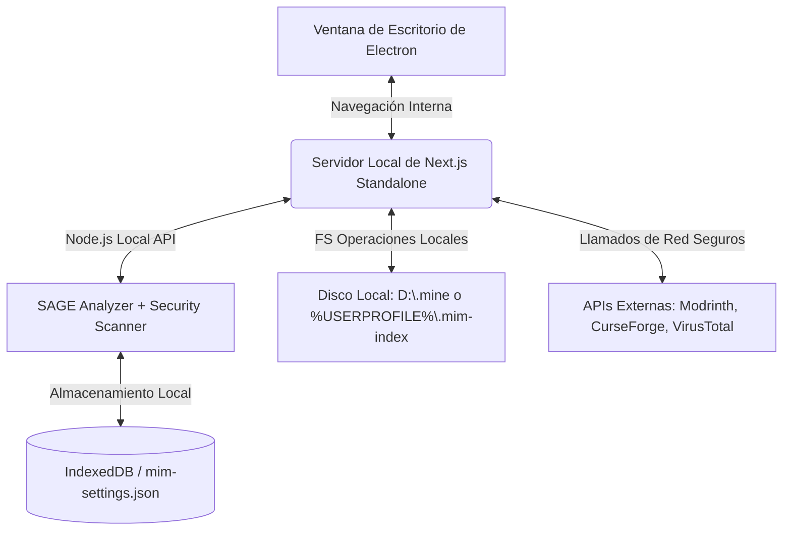

# 🚀 Plan de Compilación Standalone (EXE / MSI) con Electron + Next.js Standalone

Este documento detalla la hoja de ruta técnica y los fundamentos para empaquetar **MIM (Minecraft Intelligent Manager)** en un único ejecutable o instalador de Windows (`.exe` o `.msi`). 

El objetivo es empaquetar tu base de código actual en TypeScript y Node.js de forma **100% segura, robusta y portable**, protegiendo tu código fuente mediante empaquetado cifrado/comprimido y sin forzar al usuario a instalar nada ni obligarte a reescribir tu lógica en Rust.

---

## 🏗️ Arquitectura de Ejecución

En lugar de reescribir las complejas capas de negocio a Rust con Tauri, utilizaremos la arquitectura de **Next.js Standalone + Electron**:



### ¿Por qué esta arquitectura es perfecta para MIM?
1. **Peticiones HTTP sin CORS**: Dado que las peticiones a Modrinth y CurseForge las realiza el micro-servidor local de Node.js de Next.js en lugar de la ventana del navegador directamente, **CORS no interfiere en absoluto**.
2. **Cero exposición de API Keys**: Las claves del usuario se leen desde su `%USERPROFILE%\.mim-index\mim-settings.json` en el lado del servidor local, garantizando la privacidad de las credenciales de cada usuario.
3. **Acceso total al File System**: El backend sigue usando `fs` de Node.js de forma nativa para mover, eliminar y clonar tus mods sin las restricciones de sandbox de Tauri.

---

## 📋 Pasos de Implementación Paso a Paso

### Paso 1: Configurar Next.js en Modo Standalone

Para que Next.js compile todo tu servidor y frontend en una carpeta minimalista auto-contenida con solo las dependencias necesarias de `node_modules`, activamos la compilación Standalone.

1. Edita tu archivo [next.config.ts](file:///d:/Dev/CodeProjects/MIM/next.config.ts):
```typescript
import type { NextConfig } from "next";

const nextConfig: NextConfig = {
  output: "standalone", // Genera la carpeta compacta .next/standalone/
  images: {
    unoptimized: true,   // Necesario para evitar procesamiento pesado de imágenes nativo
  },
};

export default nextConfig;
```

---

### Paso 2: Crear el Script de Preparación (`scripts/prepare-standalone.js`)

Por diseño, Next.js no copia automáticamente los assets estáticos (`public` y `.next/static`) a la carpeta standalone para ahorrar espacio, ya que asume que un CDN se encargará de ello. Nosotros los copiaremos automáticamente mediante un sencillo script de post-construcción.

Crea el archivo [`scripts/prepare-standalone.js`](file:///d:/Dev/CodeProjects/MIM/scripts/prepare-standalone.js):
```javascript
const fs = require('fs');
const path = require('path');

function copyDir(src, dest) {
  fs.mkdirSync(dest, { recursive: true });
  let entries = fs.readdirSync(src, { withFileTypes: true });

  for (let entry of entries) {
    let srcPath = path.join(src, entry.name);
    let destPath = path.join(dest, entry.name);

    if (entry.isDirectory()) {
      copyDir(srcPath, destPath);
    } else {
      fs.copyFileSync(srcPath, destPath);
    }
  }
}

const standaloneDir = path.join(__dirname, '../.next/standalone');

if (fs.existsSync(standaloneDir)) {
  console.log('[Build] Copiando recursos estáticos a .next/standalone...');
  
  // Copiar carpeta public
  const publicSrc = path.join(__dirname, '../public');
  const publicDest = path.join(standaloneDir, 'public');
  if (fs.existsSync(publicSrc)) {
    copyDir(publicSrc, publicDest);
  }

  // Copiar assets estáticos compilados
  const staticSrc = path.join(__dirname, '../.next/static');
  const staticDest = path.join(standaloneDir, '.next/static');
  if (fs.existsSync(staticSrc)) {
    copyDir(staticSrc, staticDest);
  }

  console.log('[Build] ¡Recursos estáticos integrados con éxito!');
} else {
  console.error('[Build] Error: Carpeta standalone no encontrada. Corre next build primero.');
}
```

---

### Paso 3: Instalar Dependencias de Electron

Agregamos Electron y su empaquetador de producción a las dependencias de desarrollo. Corre en tu terminal de comandos:

```powershell
npm install --save-dev electron electron-builder
```

---

### Paso 4: Crear el Punto de Entrada de Electron (`main.js`)

Este script en JavaScript puro controlará el ciclo de vida de la aplicación. Hará lo siguiente:
1. Buscará un puerto libre automáticamente o usará un puerto por defecto (ej. `3011`) para arrancar tu servidor local de Next.js Standalone.
2. Lanzará el servidor local de Next.js de forma asíncrona como un proceso secundario (*Child Process*).
3. Esperará activamente a que el puerto esté listo (evitando que el usuario vea una ventana blanca).
4. Levantará una ventana gráfica nativa de Chromium, con dimensiones premium, apuntando a `http://localhost:3011`.
5. Escuchará el cierre de la ventana para destruir de forma segura el proceso del servidor en segundo plano, evitando dejar puertos abiertos en el sistema del usuario.

Crea el archivo [`main.js`](file:///d:/Dev/CodeProjects/MIM/main.js) en la raíz de tu proyecto:
```javascript
const { app, BrowserWindow } = require('electron');
const path = require('path');
const { spawn } = require('child_process');
const http = require('http');

let mainWindow;
let serverProcess;
const PORT = 3011; // Usamos un puerto no convencional para evitar colisiones con el dev (3000)

function startNextServer() {
  const serverPath = path.join(__dirname, '.next/standalone/server.js');
  
  console.log('[Electron] Iniciando servidor Next.js Standalone...');
  
  // Ejecutamos "node .next/standalone/server.js" en segundo plano
  serverProcess = spawn('node', [serverPath], {
    env: {
      ...process.env,
      PORT: PORT.toString(),
      HOSTNAME: '127.0.0.1', // Previene prompts del Firewall de Windows
      NODE_ENV: 'production'
    },
    cwd: path.join(__dirname, '.next/standalone')
  });

  serverProcess.stdout.on('data', (data) => {
    console.log(`[Next Server]: ${data.toString().trim()}`);
  });

  serverProcess.stderr.on('data', (data) => {
    console.error(`[Next Error]: ${data.toString().trim()}`);
  });

  serverProcess.on('close', (code) => {
    console.log(`[Next Server] Detenido con código: ${code}`);
  });
}

function checkServerReady(callback, retries = 50) {
  http.get(`http://127.0.0.1:${PORT}`, (res) => {
    if (res.statusCode === 200 || res.statusCode === 307) {
      callback();
    } else {
      setTimeout(() => checkServerReady(callback, retries - 1), 100);
    }
  }).on('error', () => {
    if (retries > 0) {
      setTimeout(() => checkServerReady(callback, retries - 1), 100);
    } else {
      console.error('[Electron] El servidor Next.js tardó demasiado en responder.');
      app.quit();
    }
  });
}

function createWindow() {
  mainWindow = new BrowserWindow({
    width: 1280,
    height: 800,
    minWidth: 900,
    minHeight: 600,
    title: 'MIM — Minecraft Intelligent Manager',
    icon: path.join(__dirname, 'public/icon.png'),
    webPreferences: {
      nodeIntegration: false,
      contextIsolation: true,
    },
    autoHideMenuBar: true, 
  });

  mainWindow.loadURL(`http://127.0.0.1:${PORT}`);

  mainWindow.on('closed', () => {
    mainWindow = null;
  });
}

app.whenReady().then(() => {
  // 1. Encendemos el servidor en segundo plano
  startNextServer();
  
  // 2. Esperamos a que responda HTTP y abrimos la ventana nativa
  checkServerReady(() => {
    createWindow();
  });
});

app.on('window-all-closed', () => {
  // Aseguramos matar el servidor local al cerrar la app para liberar recursos y puertos
  if (serverProcess) {
    serverProcess.kill();
  }
  if (process.platform !== 'darwin') {
    app.quit();
  }
});

app.on('will-quit', () => {
  if (serverProcess) {
    serverProcess.kill();
  }
});
```

---

### Paso 5: Configurar `package.json` para Electron y `electron-builder`

Modificamos el archivo `package.json` para definir la estructura de empaquetado de producción e inyectar los comandos unificados de empaquetado.

Edita tu archivo [`package.json`](file:///d:/Dev/CodeProjects/MIM/package.json):

1. Define a `main.js` como el archivo de entrada agregando `"main": "main.js"`.
2. Agrega los scripts de compilación:
   * `"build": "next build && node scripts/prepare-standalone.js"`
   * `"electron:dev": "electron ."`
   * `"electron:pack": "npm run build && electron-builder --dir"` (Para probar localmente el empaquetado rápido sin instalador)
   * `"electron:dist": "npm run build && electron-builder"` (Para compilar el `.exe` o `.msi` final redistribuible)
3. Define la sección `"build"` de `electron-builder` al final del archivo para empaquetar de forma hermética solo las carpetas necesarias (`.next/standalone`, `public`, `main.js`), excluyendo archivos fuente del repositorio para que la aplicación sea súper liviana y tu código original esté seguro en un `.asar`.

Ejemplo de configuración en [`package.json`](file:///d:/Dev/CodeProjects/MIM/package.json):

```json
{
  "name": "mim",
  "version": "5.5.0",
  "main": "main.js",
  "scripts": {
    "dev": "next dev",
    "build": "next build && node scripts/prepare-standalone.js",
    "start": "next start",
    "lint": "next lint",
    "electron:dev": "electron .",
    "electron:pack": "npm run build && electron-builder --dir",
    "electron:dist": "npm run build && electron-builder"
  },
  "dependencies": {
    // Tus dependencias normales...
  },
  "devDependencies": {
    "electron": "^30.0.0",
    "electron-builder": "^24.13.3"
    // Tus otras devDependencies...
  },
  "build": {
    "appId": "com.mim.manager",
    "productName": "MIM",
    "directories": {
      "output": "dist"
    },
    "files": [
      "main.js",
      "public/**/*",
      ".next/standalone/**/*"
    ],
    "asar": true,
    "win": {
      "target": [
        "nsis",
        "portable"
      ],
      "icon": "public/icon.png"
    },
    "nsis": {
      "oneClick": false,
      "allowToChangeInstallationDirectory": true,
      "createDesktopShortcut": true,
      "createStartMenuShortcut": true,
      "shortcutName": "MIM"
    }
  }
}
```

---

## ⚡ El Flujo de Compilación (Cómo crear tu EXE final)

Cuando quieras publicar una nueva versión estable de MIM para tu comunidad:

1. **Compilar**: Abre tu terminal y ejecuta:
   ```powershell
   npm run electron:dist
   ```
2. **Qué hace este comando tras bambalinas**:
   * Corre `next build` para generar el frontend de React optimizado y compilar el backend de rutas Node.js a código de producción Standalone.
   * Corre el script de copia para fusionar los recursos estáticos (`public` y `.next/static`) en la carpeta `.next/standalone`.
   * Llama a `electron-builder`, el cual empaqueta en un contenedor seguro (`.asar`) los archivos de tu servidor, de la ventana y los iconos.
   * Genera en la carpeta `/dist` dos archivos listos para subir a tus Releases de GitHub:
     * **`MIM Setup 5.5.0.exe`**: El instalador tradicional con asistente de instalación paso a paso, creación de accesos directos en el escritorio y panel de desinstalación.
     * **`MIM Portable 5.5.0.exe`**: Una versión portable de un solo clic que puedes compartir por pendrive o Discord, que corre de forma directa y limpia.

---

## 💎 Ventajas Técnicas Ganadas

1. **Preservación Completa del Código Sano**: SAGE, el analizador de NBT, el lector de bytecode Java de seguridad y tu API de carpetas de mods funcionan con su rendimiento óptimo de Node.js actual. No tienes que depurar complejas conversiones a Rust.
2. **Protección Intelectual**: El formato `.asar` previene que usuarios promedio puedan husmear en el código original en TypeScript o robar tu lógica de scraping y optimizaciones visuales.
3. **Mapeo Inteligente de Keys por Usuario**: Gracias a tu excelente implementación en [`lib/settings.ts`](file:///d:/Dev/CodeProjects/MIM/lib/settings.ts), el servidor local de Next.js persistirá los tokens privados de Modrinth, CurseForge y VirusTotal de cada usuario en su carpeta de usuario `%USERPROFILE%\.mim-index\mim-settings.json` sin que tengas que suministrar claves globales que puedan ser sobreexplotadas.
4. **Instalación de 5 Segundos**: El usuario descarga tu EXE de Releases, hace doble clic, y tiene MIM ejecutándose nativamente con soporte offline y en una interfaz de escritorio fluida.

---

*MIM — Compilación nativa, robusta y segura con el poder de Next.js Standalone y la madurez de Electron.*
