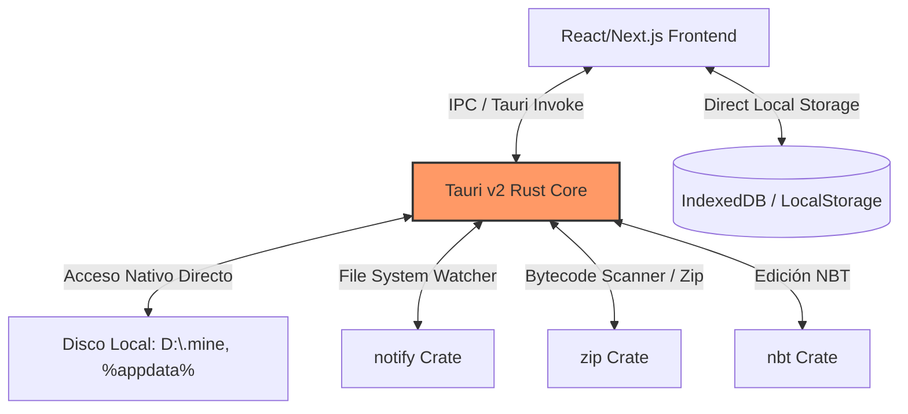

# 🚀 Plan de Compilación Standalone (EXE / MSI) sin Requisitos

Este documento detalla la hoja de ruta técnica y los fundamentos para empaquetar **MIM** en un único instalador ejecutable (`.exe` o `.msi`) para Windows. El objetivo es lograr una aplicación que **arranque instantáneamente (<50ms)**, no requiera Node.js, Rust, npm, ni ningún software preinstalado en la máquina del usuario, y use el mínimo de recursos del sistema (~15MB RAM en reposo).

---

## 🎯 El Objetivo Final
* **Para el Usuario**: Descarga un único archivo `.msi` de menos de 10MB, lo instala en 5 segundos, y la aplicación se abre de inmediato. Cero dependencias externas.
* **Para el Desarrollador**: Next.js se compila a activos estáticos (`HTML/CSS/JS`) ultra-rápidos, y toda la lógica de sistema (manipulación de archivos, watcher, lectura de NBT, seguridad bytecode) corre en la capa nativa de Rust en Tauri v2.

---

## 🏗️ Arquitectura de Alto Rendimiento

Para que la app funcione sin requisitos y arranque instantáneamente, utilizaremos la arquitectura nativa de **Tauri v2**:



---

## 📋 Pasos de Implementación

### Paso 1: Configurar Next.js para Exportación Estática (SSG)

Para que el frontend esté embebido dentro del ejecutable y no necesite un servidor de Node.js corriendo detrás, configuramos Next.js en modo **Static Export**.

1. Edita [next.config.ts](file:///d:/Dev/CodeProjects/MIM/next.config.ts):
```typescript
import type { NextConfig } from "next";

const nextConfig: NextConfig = {
  output: 'export', // Fuerza a Next.js a compilar a HTML/CSS/JS puros
  images: {
    unoptimized: true, // Requerido para exportaciones estáticas
  },
};

export default nextConfig;
```

2. Al ejecutar `npm run build`, Next.js creará una carpeta llamada `/out` en la raíz del proyecto. Este es el frontend estático que Tauri meterá dentro del `.exe`.

---

### Paso 2: Migración de APIs de Node.js a Comandos de Rust (Tauri)

Actualmente, algunas operaciones pesadas (como el escáner de seguridad en `lib/security-scanner.ts` o el lector de NBT de SAGE) usan Node.js en las rutas de API. 

Para lograr el arranque instantáneo y eliminar dependencias, migramos estas llamadas a **Tauri Commands** en Rust.

#### Ejemplo: Migración del Localizador de Directorios y Generador de Estructuras

1. **En Rust ([src-tauri/src/lib.rs](file:///d:/Dev/CodeProjects/MIM/src-tauri/src/lib.rs))**:
   Rust ya tiene implementado el comando `generate_structure` y el watcher automático de descargas nativo. Expondremos y añadiremos comandos nativos adicionales:

```rust
#[tauri::command]
fn get_downloads_path() -> Result<String, String> {
    directories::UserDirs::new()
        .and_then(|dirs| dirs.download_dir().map(|path| path.to_string_lossy().to_string()))
        .ok_or_else(|| "No se pudo determinar la carpeta de descargas".to_string())
}
```

2. **En el Frontend React ([FomoSidebar.tsx](file:///d:/Dev/CodeProjects/MIM/components/fomo/FomoSidebar.tsx))**:
   Para llamar a estos comandos y escuchar eventos de archivos descargados de forma 100% nativa en tiempo real:

```typescript
import { invoke } from "@tauri-apps/api/core";
import { listen } from "@tauri-apps/api/event";
import { useEffect } from "react";

// Escuchar descargas en tiempo real (enviadas por el Setup nativo de Rust)
useEffect(() => {
  const unlisten = listen("new_file", (event) => {
    const { path, fileName, meta } = event.payload as { path: string, fileName: string, meta: any };
    console.log(`Nuevo mod detectado nativamente: ${fileName}`, meta);
    // Añadir a la UI al instante
  });
  
  return () => {
    unlisten.then(f => f());
  };
}, []);

// Llamar a la clasificación súper rápida de un mod
const handleClassify = async (fileName: string, sourcePath: string, category: string) => {
  try {
    const result = await invoke("classify_mod", {
      fileName,
      sourcePath,
      targetCategory: category,
      modloader: "forge", // Dinámico
      version: "1.20.1"    // Dinámico
    });
    console.log(result); // "Moved to category"
  } catch (err) {
    console.error("Error clasificando mod nativamente:", err);
  }
};
```

---

### Paso 3: Optimización del Escáner de Seguridad en Rust

La lectura y el análisis de bytecode de archivos `.jar` grandes (que son archivos ZIP renombrados) es increíblemente ineficiente en JS. Al moverlo a Rust usando la biblioteca `zip`, el escaneo de amenazas pasa de tardar **segundos** a resolverse en **milisegundos**.

En [src-tauri/src/lib.rs](file:///d:/Dev/CodeProjects/MIM/src-tauri/src/lib.rs), ya tenemos la base optimizada de `deep_scan_mod` para detectar loaders. Podemos exponerla como un comando directo para la UI:

```rust
#[tauri::command]
fn scan_jar_security(file_path: String) -> Result<serde_json::Value, String> {
    let path = std::path::Path::new(&file_path);
    if !path.exists() {
        return Err("El archivo no existe".to_string());
    }
    
    // Ejecuta la función de escaneo profundo de firmas y bytecode
    let scan_result = deep_scan_mod(path);
    Ok(scan_result)
}
```

---

### Paso 4: El Pipeline de Compilación (EXE / MSI)

Para generar el instalador standalone de producción en tu máquina de desarrollo, sigue estos simples pasos:

#### 🛠️ Pre-requisitos (Solo para ti, el desarrollador, una sola vez):
1. **Rust**: Instala Rust desde [rustup.rs](https://rustup.rs/).
2. **WiX Toolset v3**: Requerido por Tauri para empaquetar el instalador `.msi`. Se instala automáticamente mediante Tauri CLI o puedes descargarlo desde su web oficial.

#### 📦 Comando de Compilación Unificado:
En tu consola de comandos, ejecuta:

```powershell
npm run build         # Genera el frontend optimizado en /out
npx tauri build       # Compila el núcleo Rust + Frontend estático en un instalador nativo
```

> [!TIP]
> Puedes añadir un script de acceso rápido en tu [package.json](file:///d:/Dev/CodeProjects/MIM/package.json):
> `"tauri:build": "next build && tauri build"`
> Para compilar todo en un único comando rápido: `npm run tauri:build`

---

## 💎 Ventajas de este Enfoque

1. **Arranque Instantáneo**: Al no haber servidor de Node corriendo de fondo ni peticiones de red locales que inicializar, el WebView nativo cargará los activos estáticos directamente desde la memoria RAM del ejecutable.
2. **Consumo de Memoria Reducido**: Se elimina todo el peso del runtime de Node.js en producción. La app consume apenas ~15MB a 30MB en reposo.
3. **Distribución Simple**: El compilador te entregará dos archivos en `src-tauri/target/release/bundle/`:
   * Un `.msi` (instalador tradicional de Windows).
   * Un `.exe` (ejecutable portátil que puedes llevar en un pendrive).
4. **Seguridad Total**: Al no exponer puertos locales abiertos (como el puerto `3000`), no hay peligro de colisiones de puertos ni vulnerabilidades de red locales.

---

## 🗺️ Siguientes Pasos Recomendados

1. **Establecer exportación estática**: Añadir `"output": "export"` en `next.config.ts`.
2. **Mapear funciones críticas**: Reemplazar progresivamente las llamadas de `/api/` en el frontend por invocaciones `invoke(...)` de Tauri.
3. **Compilar versión Alpha local**: Correr `npx tauri build` localmente para comprobar que el primer paquete `.exe` standalone se genera correctamente.
