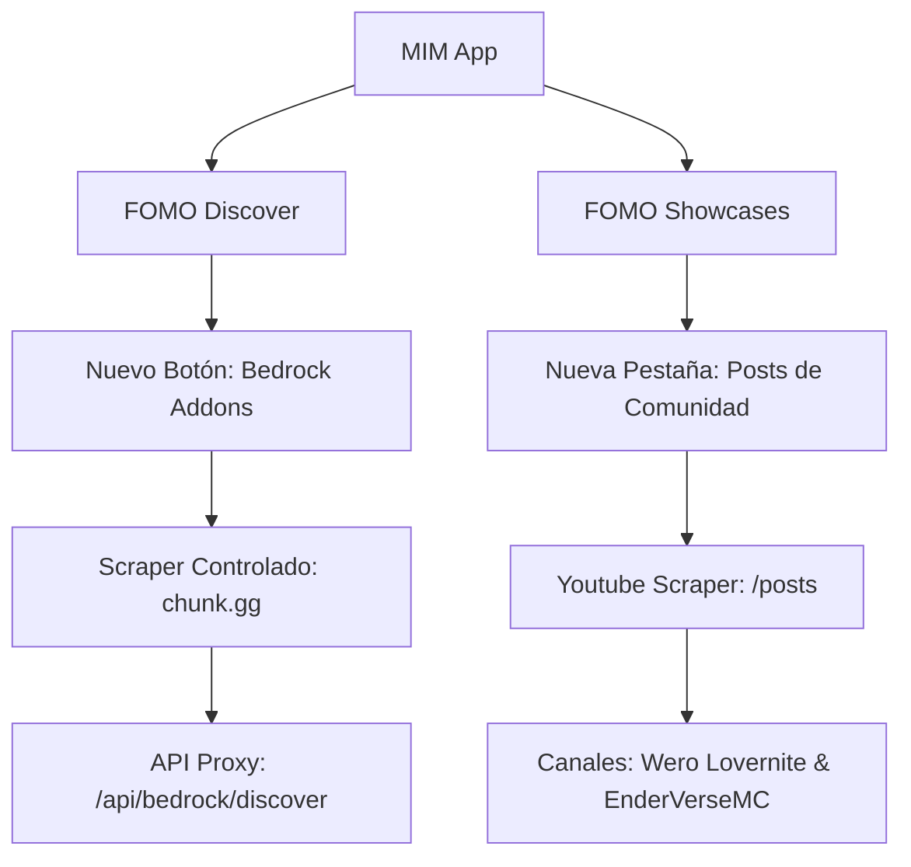

# 📋 TODO: Bedrock Addons (chunk.gg) & YouTube Community Posts Showcases

Este documento organiza y planifica el diseño técnico, la arquitectura de endpoints y los componentes de UI necesarios para implementar dos nuevas ideas en **MIM (Minecraft Intelligent Manager)** más adelante.

---

## 📌 Resumen de Objetivos



1. **YouTube Community Posts Showcases**:
   - Soporte para canales dedicados a Bedrock o Java que publican sus compilaciones de mods en la pestaña `/posts` de su canal (por ejemplo, `@Wero_lovernite` y `@EnderVerseMC`).
   - Automatización de extracción y detección de enlaces en el texto de los posts.
2. **Bedrock Addons Discovery (chunk.gg)**:
   - Integración de una fuente alternativa de descubrimiento en el Discover Panel para buscar addons de Bedrock Edition.
   - Implementación de un scraper controlado y con cacheo agresivo en la web de `chunk.gg`.

---

## 1. Showcase de Posts de Comunidad de YouTube 📺

### 🔍 Análisis de la Limitación Actual
Actualmente, `FomoYoutubeShowcase` usa `yt-dlp` para descargar la metadata de los últimos videos/shorts. `yt-dlp` **no soporta la pestaña `/posts` de comunidad de forma directa**, ya que no son recursos multimedia estándares.

### 🛠️ Solución Propuesta: API de Scraping HTML de Comunidad

Crearemos un endpoint `/api/fomo/youtube-posts` que realice una consulta controlada a la pestaña de posts del canal y parsee el objeto interno de YouTube `ytInitialData`.

#### 📝 Crear Endpoint: `app/api/fomo/youtube-posts/route.ts`

```typescript
import { NextResponse } from "next/server";
import crypto from "crypto";
import fs from "fs";
import path from "path";
import { getPortableDir } from "@/lib/core/settings";

const CACHE_DIR = path.join(getPortableDir(), "cache");

// Canales predeterminados de posts
export const HARDCODED_POSTS_CHANNELS = [
  "https://www.youtube.com/@Wero_lovernite",
  "https://www.youtube.com/@EnderVerseMC"
];

export async function GET(request: Request) {
  const { searchParams } = new URL(request.url);
  const channelUrl = searchParams.get("channel") || HARDCODED_POSTS_CHANNELS[0];

  // Generar hash de cacheo (válido por 12 horas)
  const channelHash = crypto.createHash("md5").update(channelUrl).digest("hex").substring(0, 10);
  const cacheFile = path.join(CACHE_DIR, `showcase_posts_${channelHash}.json`);

  // 1. Validar caché existente
  if (fs.existsSync(cacheFile)) {
    const stats = fs.statSync(cacheFile);
    const ageHours = (new Date().getTime() - new Date(stats.mtime).getTime()) / (1000 * 60 * 60);
    if (ageHours < 12) {
      return NextResponse.json(JSON.parse(fs.readFileSync(cacheFile, "utf-8")));
    }
  }

  try {
    const handle = channelUrl.split("/").pop() || "";
    const targetUrl = `https://www.youtube.com/${handle}/posts`;

    // Fetch con User-Agent moderno para imitar browser real
    const response = await fetch(targetUrl, {
      headers: {
        "User-Agent": "Mozilla/5.0 (Windows NT 10.0; Win64; x64) AppleWebKit/537.36 (KHTML, like Gecko) Chrome/120.0.0.0 Safari/537.36",
        "Accept-Language": "es-ES,es;q=0.9,en;q=0.8"
      }
    });
    const html = await response.text();

    // Extraer el JSON de ytInitialData incrustado en el HTML de YouTube
    const regex = /var ytInitialData = ({.*?});<\/script>/;
    const match = html.match(regex);
    if (!match) {
      throw new Error("No se pudo extraer la metadata de YouTube Posts");
    }

    const data = JSON.parse(match[1]);
    
    // Recorrer el árbol JSON para encontrar los posts de comunidad
    // Estructura de navegación habitual en YT:
    // data.contents.twoColumnBrowseResultsRenderer.tabs[...] -> tab con "community"
    const tabs = data.contents?.twoColumnBrowseResultsRenderer?.tabs || [];
    const communityTab = tabs.find((t: any) => t.tabRenderer?.title === "Comunidad" || t.tabRenderer?.title === "Community");
    
    const contents = communityTab?.tabRenderer?.content?.sectionListRenderer?.contents?.[0]?.itemSectionRenderer?.contents || [];

    const posts: any[] = [];
    for (const item of contents) {
      const postRenderer = item.backstagePostThreadRenderer?.post?.backstagePostRenderer;
      if (!postRenderer) continue;

      const postId = postRenderer.postId;
      const rawText = postRenderer.contentText?.runs?.map((r: any) => r.text).join("") || "";
      const publishedTime = postRenderer.publishedTimeText?.runs?.[0]?.text || "";
      
      // Extraer imágenes adjuntas si existen
      const attachment = postRenderer.attachment?.backstageImageRenderer;
      const thumbnail = attachment?.image?.thumbnails?.[0]?.url || "";

      // Regex para detectar slugs/enlaces de Modrinth y CurseForge
      const MODRINTH_REGEX = /modrinth\.com\/(mod|plugin|datapack|shader|resourcepack|modpack)\/([a-zA-Z0-9-_]+)/g;
      const CURSEFORGE_REGEX = /curseforge\.com\/minecraft\/(mc-mods|texture-packs|customization|mc-addons)\/([a-zA-Z0-9-_]+)/g;
      
      const modSlugs: string[] = [];
      let mMatch;
      while ((mMatch = MODRINTH_REGEX.exec(rawText)) !== null) {
        modSlugs.push(`modrinth:${mMatch[1]}:${mMatch[2]}`);
      }
      while ((mMatch = CURSEFORGE_REGEX.exec(rawText)) !== null) {
        modSlugs.push(`curseforge:${mMatch[1]}:${mMatch[2]}`);
      }

      posts.push({
        postId,
        title: rawText.substring(0, 150) + (rawText.length > 150 ? "..." : ""),
        description: rawText,
        thumbnail,
        videoUrl: `https://www.youtube.com/post/${postId}`,
        modSlugs: [...new Set(modSlugs)],
        publishedAt: publishedTime,
      });
    }

    const responseData = { mode: "posts", showcases: posts };
    
    // Guardar en cache
    if (!fs.existsSync(CACHE_DIR)) fs.mkdirSync(CACHE_DIR, { recursive: true });
    fs.writeFileSync(cacheFile, JSON.stringify(responseData, null, 2), "utf-8");

    return NextResponse.json(responseData);
  } catch (err: any) {
    return NextResponse.json({ error: err.message }, { status: 500 });
  }
}
```

### 📋 Checklist de Integración en la UI (FomoYoutubeShowcase)
- [ ] **Configuración en el Sidebar/Showcase**:
  - Agregar botones selectores de fuente en la pestaña de showcases para alternar entre "Videos Recientes" y "Publicaciones de Comunidad".
- [ ] **Modo de Render Dual**:
  - Si el canal es `@Wero_lovernite` o `@EnderVerseMC`, usar por defecto el modo `posts` consumiendo `/api/fomo/youtube-posts`.
  - Adaptar la tarjeta `YoutubeTriggerCard` para que en el modo de posts renderice la imagen adjunta o, si no tiene imagen, use un fallback temático y elegante de Minecraft Bedrock.

---

## 2. Buscador de Bedrock Addons (Scrapeo de chunk.gg) 🧩

### 🔍 Análisis de la Estructura de chunk.gg
Al explorar la estructura del DOM de `chunk.gg`, notamos que la navegación cataloga los addons con la siguiente estructura de datos en sus tarjetas de producto:
- **Catálogo de Add-ons**: `https://chunk.gg/add-ons`
- **Paginación**: `https://chunk.gg/add-ons?page=1`
- **Tarjeta de Producto**: Un elemento anchor `<a>` que apunta a `/@creador/addon-slug` que contiene:
  - **Título**: Un tag `###` (e.g. `LEGO MINECRAFT CHICKEN MOUNTS`).
  - **Creador**: Un texto adyacente (e.g. `Minecraft`).
  - **Ratings/Precio**: Indica las valoraciones (e.g. `3,739 Ratings`) y precio en Minecoins o si es `Free`.
  - **Imagen**: Miniaturas hospedadas en CDN de Minecraft/Chunk.

### 🛠️ Solución Propuesta: API Bedrock Proxy en Next.js

Crearemos el endpoint `/api/bedrock/discover` que simulará la búsqueda en la web `chunk.gg` parseando su HTML para transformarlo a nuestro estándar unificado `ModHit[]`.

#### 📝 Crear Endpoint: `app/api/bedrock/discover/route.ts`

```typescript
import { NextResponse } from "next/server";
import * as cheerio from "cheerio"; // Requiere: npm install cheerio
import crypto from "crypto";
import fs from "fs";
import path from "path";
import { getPortableDir } from "@/lib/core/settings";

const CACHE_DIR = path.join(getPortableDir(), "cache");

export async function GET(request: Request) {
  const { searchParams } = new URL(request.url);
  const query = searchParams.get("q") || "";
  const page = searchParams.get("page") || "1";

  // Cachear los resultados por 6 horas para ser amigables con chunk.gg
  const cacheKey = `chunk_discover_${crypto.createHash("md5").update(query + "_" + page).digest("hex").substring(0, 10)}.json`;
  const cacheFile = path.join(CACHE_DIR, cacheKey);

  if (fs.existsSync(cacheFile)) {
    const stats = fs.statSync(cacheFile);
    const ageHours = (new Date().getTime() - new Date(stats.mtime).getTime()) / (1000 * 60 * 60);
    if (ageHours < 6) {
      return NextResponse.json(JSON.parse(fs.readFileSync(cacheFile, "utf-8")));
    }
  }

  try {
    let targetUrl = `https://chunk.gg/add-ons?page=${page}`;
    
    // Si hay búsqueda, usamos la ruta de búsqueda de chunk.gg
    if (query) {
      targetUrl = `https://chunk.gg/search?q=${encodeURIComponent(query)}`;
    }

    const response = await fetch(targetUrl, {
      headers: {
        "User-Agent": "Mozilla/5.0 (Windows NT 10.0; Win64; x64) AppleWebKit/537.36 (KHTML, like Gecko) Chrome/120.0.0.0 Safari/537.36"
      }
    });

    if (!response.ok) throw new Error("Error fetching content from chunk.gg");
    const html = await response.text();
    const $ = cheerio.load(html);

    const mods: any[] = [];

    // Parsear las tarjetas de producto
    // Basado en el HTML analizado de chunk.gg:
    $("a[href*='/@']").each((_, element) => {
      const card = $(element);
      const link = card.attr("href");
      if (!link) return;

      // Ejemplo de href: /@minecraft/lego-minecraft-chicken-mounts
      const parts = link.replace(/^\//, "").split("/");
      const creatorRaw = parts[0] ? parts[0].replace("@", "") : "Minecraft";
      const slug = parts[1] || "";

      const title = card.find("h3").text().trim();
      if (!title) return; // Evitar capturar enlaces rotos

      // Intentar extraer ratings
      const textBlock = card.text();
      const ratingsMatch = textBlock.match(/([\d,]+)\s+Ratings/i);
      const ratingsCount = ratingsMatch ? parseInt(ratingsMatch[1].replace(/,/g, ""), 10) : 0;

      // Determinar Minecoins / Gratis
      const isFree = textBlock.toLowerCase().includes("free");
      const minecoinsMatch = textBlock.match(/(\d+)\s+Minecoins/i);
      const cost = isFree ? "Gratis" : minecoinsMatch ? `${minecoinsMatch[1]} Minecoins` : "Premium";

      // Intentar deducir la imagen
      const imgUrl = card.find("img").attr("src") || "";

      mods.push({
        projectId: `chunk:${creatorRaw}:${slug}`,
        slug: slug,
        title: title,
        description: `Add-on oficial del Minecraft Marketplace diseñado por ${creatorRaw}. Precio: ${cost}.`,
        iconUrl: imgUrl,
        author: creatorRaw,
        downloads: ratingsCount * 12, // Factor heurístico para simular volumen
        follows: ratingsCount,
        latestVersion: "Bedrock Edition",
        categories: ["bedrock", "addon", cost.toLowerCase()],
        dateCreated: new Date().toISOString(), // Fallback
        url: `https://chunk.gg${link}`,
        projectType: "bedrock-addon",
        _source: "chunk"
      });
    });

    const responseData = {
      mods,
      total: mods.length,
      totalPages: 1
    };

    if (!fs.existsSync(CACHE_DIR)) fs.mkdirSync(CACHE_DIR, { recursive: true });
    fs.writeFileSync(cacheFile, JSON.stringify(responseData, null, 2), "utf-8");

    return NextResponse.json(responseData);
  } catch (err: any) {
    return NextResponse.json({ error: err.message }, { status: 500 });
  }
}
```

### 📋 Checklist de Modificaciones en la UI

#### A. Registrar la Nueva Fuente (`chunk`) en `FomoDiscoverContext.tsx`
Agregar la opción `chunk` a la UI del grupo de pestañas:

```diff
 const SOURCE_OPTIONS = [
   { value: "all", label: "Ambos" },
   { value: "modrinth", label: "Modrinth", icon: <ModrinthIcon /> },
   { value: "curseforge", label: "CurseForge", icon: <CurseForgeIcon /> },
+  { value: "chunk", label: "Bedrock Addons", icon: <BedrockIcon /> },
 ];
```

#### B. Adaptar el Hook de Búsqueda (`useFomoSearch.ts`)
Conectar el nuevo endpoint proxy cuando el source seleccionado es `"chunk"`:

```diff
       } else if (source === "all") {
         // ... descargas paralelas usuales ...
+      } else if (source === "chunk") {
+        const res = await fetch(`/api/bedrock/discover?${params}`);
+        if (!res.ok) throw new Error("Error en la API de Bedrock");
+        const data = await res.json();
+        fetchedMods = (data.mods || []).map((m: any) => ({ ...m, _source: "chunk" }));
+        setTotal(data.total || 0);
+        setTotalPages(data.totalPages || 1);
       } else {
         const res = await fetch(`/api/${source}/discover?${params}`);
```

#### C. Controlar Filtros No Compatibles en `FomoDiscoverFilters.tsx`
Cuando `source === "chunk"`:
- [ ] Ocultar o deshabilitar el dropdown de **Mod Loader** (Forge, Fabric, etc.) ya que en Bedrock no aplica.
- [ ] Cambiar el placeholder de búsqueda a `"Buscar addons en Marketplace..."`.
- [ ] Habilitar insignias dinámicas especiales en `FomoModCard` con el indicador de **Minecoins** o la etiqueta **Bedrock**.

#### D. Desvío de Descarga Inteligente en `useFomoDiscover.ts`
Como los Addons oficiales del Bedrock Marketplace se descargan directamente en el juego o requieren ir a la web/tienda:
- [ ] Capturar el click de descarga en `handleDownload`.
- [ ] Si `mod._source === "chunk"`, en lugar de buscar un `.jar` de Java, abrir directamente la URL externa en el navegador mediante:
  `window.open(mod.url, "_blank")`
  y mostrar un status informativo elegante:
  `showStatus("Redirigiendo al Minecraft Marketplace para obtener el addon...", "info")`

---

## 📈 Conclusión & Próximos Pasos

Este plan permite expandir el ecosistema de **MIM** al mercado de Bedrock de manera limpia, sin perturbar el código crítico de Java y reutilizando el 90% de las tarjetas e interfaces ya pulidas con el diseño *Premium Liquid Glass*.

> [!TIP]
> Al comenzar a desarrollar esto en el futuro, instala `cheerio` para el parsing HTML ligero en backend:
> ```bash
> npm install cheerio
> ```
